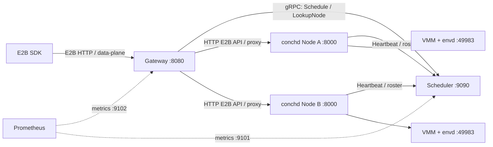
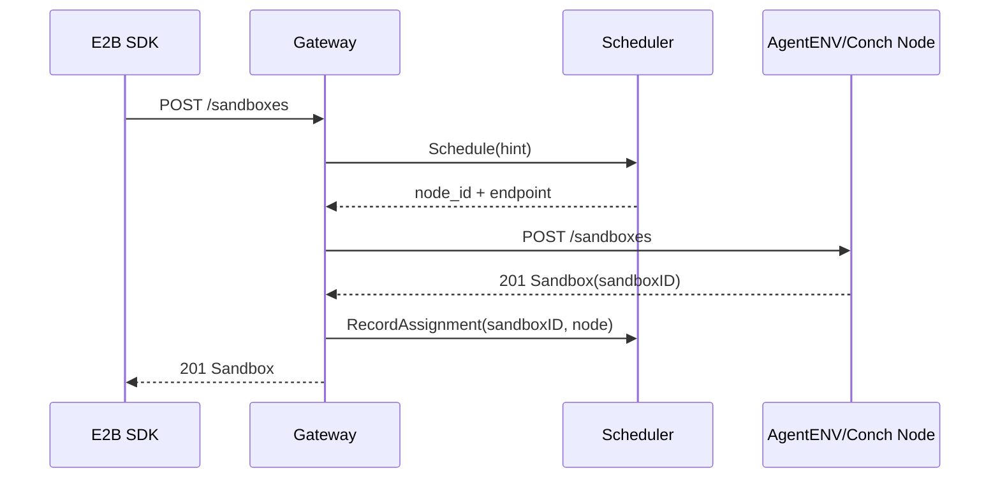
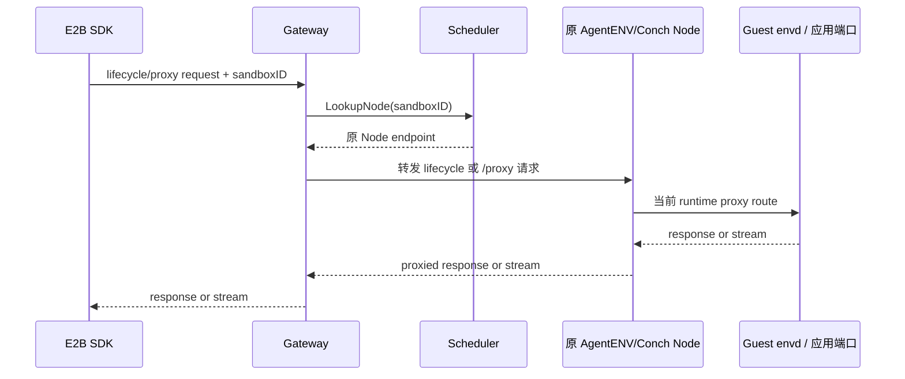
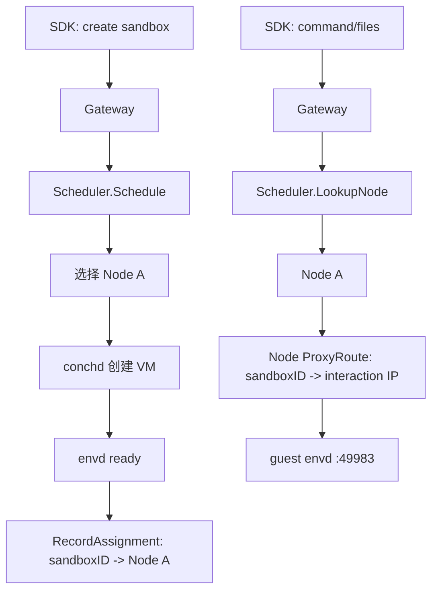
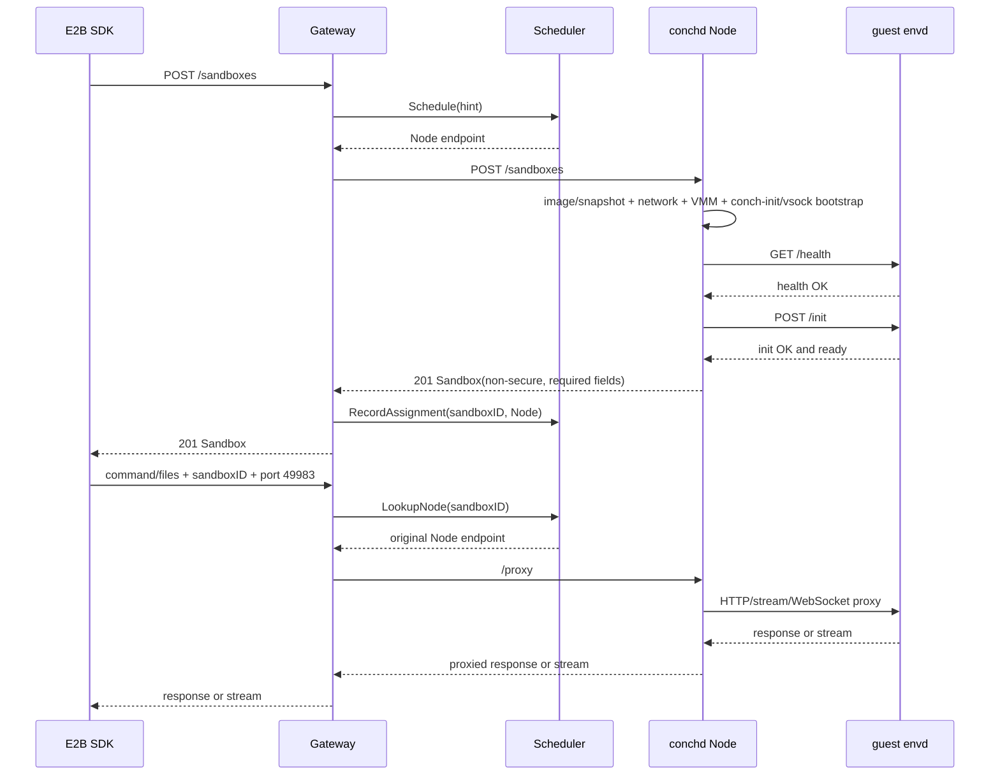
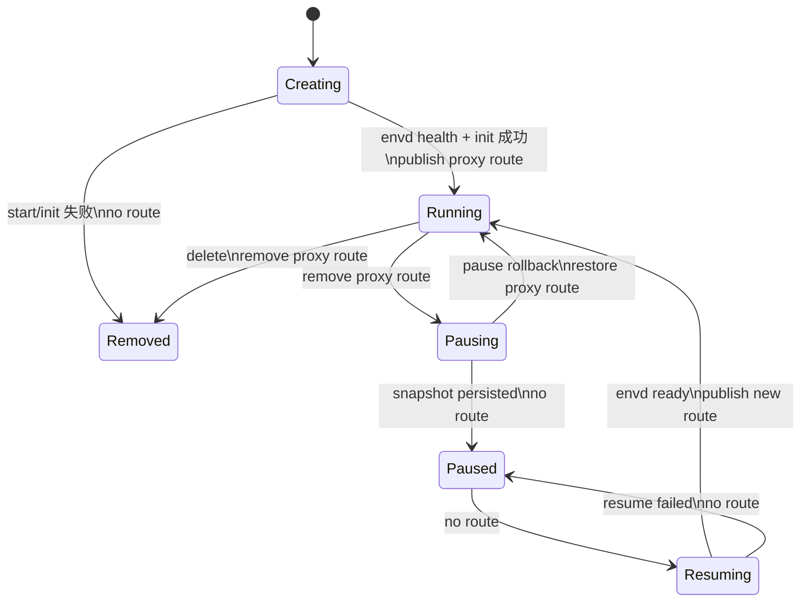

# Conch 接入 E2B SDK 与 AgentENV Gateway/Scheduler 的设计方案

**状态**：设计草案\
**Conch 基线**：远端 `origin/dev`，提交 `8248022005542407f53b606a8be979379a3fd38b`；不采用本地未提交修改。\
**参考实现**：`AgentENV`、`Conch`、`E2B`、`infra`。

**本期约束与假设**：

- 不修改 AgentENV Gateway、Scheduler 或 `scheduler.proto`，所有适配在 Conch 侧完成。
- 集群 MVP 实现 create/get/list/delete、proxy、envd 和 heartbeat；E2B pause/resume/connect 暂返回 `Unimplemented`（HTTP `501 Not Implemented`），并在对应方法注释中说明完整暂停/恢复语义留待后续实现。
- 所有可调度 Node 预置相同的模板名称到 Boot Index digest 的映射及对应工件；本期不实现模板跨节点分发。
- 明确保留 `conch-init` 的 guest 启动和 vsock 网络初始化；本期 E2B SDK 接入仅支持 non-secure，调用方显式设置 `secure=false`。
- 本期验证服务正常运行时的集群链路；节点未就绪/故障避让、binding 写入失败、断连与重启恢复等失败场景暂不展开，也不作为本期验收项。
- 接口路径、字段、枚举和响应以实际对接版本的源码为准。本文 AgentENV 核对提交为 `1d742e4e149092be895f2c3cf0a097201229a250`；下文映射表仅作说明，不替代其 OpenAPI、`scheduler.proto` 和 SDK/envd 实现。

目标架构固定为：

```text
E2B SDK -> AgentENV Gateway（集群入口） -> conchd（Node） -> guest envd
                      |                         |
                      +-> AgentENV Scheduler <---+
                         选点、binding、heartbeat
```

Gateway 和 Scheduler 是独立 Go 服务；`conchd` 是每个计算节点上的本地 runtime/orchestrator。Scheduler 不承载 SDK 数据流，真实数据路径始终是 `SDK -> Gateway -> conchd -> envd`。



## 1. AgentENV 的集群调度和 Gateway 如何实现与功能

### 1.1 组件和部署关系

| 组件 | AgentENV 代码/二进制 | 默认端口 | 保存的主要状态 | 不负责的事情 |
| --- | --- | --- | --- | --- |
| Gateway | `services/gateway/`，`bin/gateway` | HTTP `8080`，metrics `9102` | 配置、Scheduler client、请求上下文；接近无状态 | VM、snapshot、envd、Node 资源与 binding 真相。 |
| Scheduler | `services/scheduler/`，`bin/scheduler` | gRPC `9090`，metrics `9101` | Node registry、heartbeat snapshot、`sandboxID -> Node` binding | HTTP proxy、VMM、envd、snapshot、sandbox TTL。 |
| AgentENV Node | Rust `server`，每台机器一个 | HTTP `8000` | lifecycle metadata、live backend、proxy route、paused state | 跨 Node 选点与公网统一入口。 |

Gateway 与 Scheduler 首先都是普通独立进程：可以以裸机/systemd 方式运行，也可以被 Docker 或 Kubernetes 打包、托管。容器和 Kubernetes 不是它们的业务组成部分。

- Docker Compose：`gateway`、`scheduler`、`agentenv-a`、`agentenv-b` 是四类不同容器。Gateway/Scheduler 不需要 `/dev/kvm` 或 privileged；Node 需要。
- Kubernetes：Gateway 是 `Deployment + Service`；Scheduler 是 `Deployment + Service`；Node 是 privileged `DaemonSet`。Kubernetes Service 只提供 DNS/四层转发，不执行 sandbox 路由。Scheduler 也不是 Kubernetes Scheduler；它只选择某次 sandbox create 应发送到哪个 Node。

`[cluster]` 不是第四个名为 cluster 的 daemon。cluster 是 Scheduler 发现的 Node、Node heartbeat 的 `cluster_id`、资源快照、sandbox roster，以及 Scheduler binding 共同构成的逻辑调度域。

### 1.1.1 为什么 Gateway 和 Scheduler 各有两个端口

这里的“两个对外端口”应区分为 **业务/控制端口** 和 **监控端口**。监控端口通常只对 Prometheus 或运维网络开放，不应该暴露到 SDK 或公网。

| 服务 | 端口 | 协议 | 谁连接 | 作用 | 不应该用于 |
| --- | --- | --- | --- | --- | --- |
| Gateway | `:8080` | HTTP | E2B SDK、CLI、外部 LB/Ingress、应用数据面请求 | lifecycle API、`/proxy`、host-based sandbox traffic、`/health` | Prometheus 抓取内部指标。 |
| Gateway | `:9102` | HTTP | Prometheus | `/metrics`：Gateway HTTP 请求、上游 Node、Scheduler RPC 等运行指标 | SDK API、sandbox proxy；public listener 上的 `/metrics` 默认不提供。 |
| Scheduler | `:9090` | gRPC | Gateway、Node reporter、管理组件 | `Schedule`、`LookupNode`、`RecordAssignment`、`Heartbeat`、Node 查询；也有 gRPC health service | SDK HTTP、sandbox 应用流量。 |
| Scheduler | `:9101` | HTTP | Prometheus | `/metrics`：调度、binding、heartbeat、RPC 延迟/错误等指标 | gRPC 调度 RPC、SDK 或 Node lifecycle 请求。 |

分端口的目的不是功能重复，而是隔离协议、权限和流量模型：

- Gateway `8080` 要支持普通 HTTP、长连接、HTTP upgrade、SSE 和 WebSocket；`9102` 只需快速返回 Prometheus exposition 格式。
- Scheduler `9090` 是内部 gRPC API，适合 gRPC health probe；`9101` 只运行 Prometheus HTTP handler，监控系统无需理解 gRPC。
- Kubernetes/Docker 部署可以分别暴露或限制这些端口：Gateway `8080` 可放到 Service/Ingress，Scheduler `9090` 应仅集群内部可见，`9101/9102` 应仅由监控网络访问。

所以 Scheduler `9090` 是对 Gateway/Node 的内部控制面“对外”端口，不是面向最终用户的 API；面向 SDK 的入口是 Gateway `8080`。

### 1.2 Gateway 的功能和请求流

Gateway 对 SDK 提供统一 HTTP 入口。SDK 配置 `E2B_API_URL`、`E2B_SANDBOX_URL` 和 `E2B_API_KEY`，不需要知道具体 Node 地址；本期创建时还必须显式设置 Python `secure=False` / TypeScript `secure: false`。`secure=true` 暂返回 `Unimplemented`，不静默降级。

其中，`E2B_API_URL` 是控制面地址（创建、查询、暂停、恢复、删除 sandbox/template），`E2B_SANDBOX_URL` 是 sandbox 数据面地址（envd command/files/process/PTY/WebSocket）。Conch 直接采用 AgentENV 的单入口方案：两个变量配置为同一个 Gateway 地址。

```bash
export E2B_API_URL=http://gateway.example.internal:8080
export E2B_SANDBOX_URL=${E2B_API_URL}
export E2B_API_KEY=<shared-api-key>
```

这是 AgentENV Node 与 Gateway 支持 sandbox routing header fallback 的结果：SDK 的控制面和数据面请求都会抵达 Gateway；Gateway/Node 再根据 sandbox ID 和目标端口将数据面请求转发到对应 guest。`/proxy` 是保留的旧式显式数据面前缀：例如请求 `http://gateway:8080/proxy/health`，并携带 sandbox ID/port routing header 时，Node 会去掉 `/proxy` 前缀后把 `/health` 转发到 guest。

Gateway 的功能：

1. 控制面 API key 验证；
2. 新 sandbox 请求的调度和 HTTP 代理；
3. 已有 sandbox 的精确路由；
4. `/proxy`、routing header、host-based sandbox URL 的 HTTP/SSE/WebSocket 转发；
5. `GET /sandboxes`、`GET /v2/sandboxes` 的跨 Node 聚合，以及 `/nodes` 查询。

新建 sandbox 的路径：



Gateway 对 `POST /sandboxes` 只提取 metadata hint；CPU、内存、image 等属于 `POST /sandboxes-cold` hint。当前内置 `round_robin` / `random` 策略不使用 hint；配置资源阈值时先按 Node heartbeat snapshot 过滤。请求级容量校验、并发创建的资源预留和最终资源分配仍由 Conch 负责。仅当 Node 成功返回后，Gateway 才尝试写 assignment；写入失败场景暂不展开。

已有 sandbox 的路径：



已有 ID 不能重新 `Schedule`，因为新 Node 没有原 Node 的 VM、network namespace 和运行时资源。host-based URL 形如 `{port}-{sandboxID}.{domain}`；header 兼容 `x-agentenv-sandbox-id` / `e2b-sandbox-id` 和 target port header。Gateway 将 host route 转成目标 Node 的 `/proxy` 请求，但不直接连接 guest。

Gateway 对集群 list 扇出到 Scheduler 已知的全部 Node，当前采用 all-or-nothing：任何 Node 不可达或非 2xx，整体 list 失败，不伪造不完整结果。Gateway 普通请求 timeout 不应截断 streaming/WebSocket；它的 `forward_response_size` 只限制为 create response 提取 sandbox ID 的缓冲，并不是通用 body 限额。

Gateway 不判断 sandbox 应用是否私有、也不拥有 envd token。Node 才根据该 sandbox 的 policy 验证：

| 流量 | 凭证 | 最终校验者 |
| --- | --- | --- |
| lifecycle/template 等控制面 | `X-API-Key` | Gateway 与 Node。 |
| private 应用端口 | `e2b-traffic-access-token` | Node proxy。 |
| secure envd `:49983` | `X-Access-Token` | Node proxy/envd。 |

上表包含 AgentENV 的完整能力；Conch 本期仅支持 non-secure envd，secure envd token/MMDS 适配留待后续。Gateway/Node 的控制面 `X-API-Key` 和现有 `conch-init-token` 仍保留。

#### `domain` 由谁返回、由谁路由

E2B `Sandbox`/`SandboxDetail` response 中的 `domain` 是“sandbox 数据面可访问的**基础域名**”，不是完整 URL，也不是某个 Node IP。SDK 使用它拼出例如：

```text
{port}-{sandboxID}.{domain}
# 例如 49983-<sandbox-id>.sandbox.example.com
```

在 AgentENV 当前代码中，`domain` **由 Node API 填入，不是 Gateway 生成或覆盖的**：`ApiImpl::sandbox_model()` 和 `sandbox_detail_model()` 从本节点 `[sandbox_proxy].domains` 的第一个值写入 response。因此该能力属于 Node runtime/orchestrator 对外 API 的一部分；即使单节点不部署 Gateway，Node 也会返回自己配置的 domain。

Gateway 的 `gateway.sandbox_proxy_domains` 有不同职责：它告诉 Gateway 哪些 Host 应按 `{port}-{sandboxID}.{domain}` 解析、再经 `LookupNode` 转发给所属 Node。Gateway 将 Node 的 create/get response 原样代理回客户端，不会事后计算或替换 `domain`。

多节点部署必须满足以下不变量：

```text
所有 conchd Node 的第一个 sandbox_proxy.domains 值
    == Gateway 的 gateway.sandbox_proxy_domains 中可接受的域名
    == DNS / wildcard DNS 实际指向 Gateway 的域名
```

AgentENV 的 Docker/Kubernetes 部署辅助配置将一个 `SANDBOX_PROXY_DOMAINS` 同时传给 Gateway 和 Node，正是为维持这个不变量。Conch 适配时也应采用一个共享配置源；不能让 Node 返回 `sandbox-a.example.com`，而 Gateway 只接受 `sandbox-b.example.com`，否则 SDK 得到的 URL 无法路由。

### 1.3 Scheduler 的功能和状态模型

Scheduler 的四个内部职责：

| 模块 | 功能 |
| --- | --- |
| NodeRegistry | 保存 `node_id + HTTP endpoint`，叠加最新 heartbeat snapshot。 |
| Discovery | `static` 从配置读取节点，或 `kubernetes` 监听 headless Service 的 EndpointSlice。 |
| Resource filter + Strategy | 配置 `node_resource_limit` 时按 sandbox 数、CPU/内存使用/分配阈值过滤，再运行 `round_robin` 或 `random`；不提供请求级容量预留或模板可用性选点。 |
| BindingStore | 保存 `sandboxID -> {node_id, endpoint}`；可用内存或 Redis。 |

关键 RPC：

| RPC | 调用方 | 写状态 | 作用 |
| --- | --- | --- | --- |
| `Schedule` | Gateway | 否 | 返回一个候选 Node；不创建 sandbox，也不写 binding。 |
| `RecordAssignment` | Gateway | 是 | Node 创建成功后写 binding。 |
| `LookupNode` | Gateway | 读，可能清除过期项 | 解析已有 sandbox 的所属 Node；miss 返回 NotFound。 |
| `ListNodes` | Gateway | 否 | 返回 discovery Node endpoints，供 list 扇出。 |
| `Heartbeat` | Node reporter | 是 | 更新资源快照并以完整 sandbox roster 刷新 binding。 |
| `ListObservedNodes`/`GetNode` | Gateway/admin | 否 | 返回 Node health/资源视图。 |
| `UnregisterNode` | Node reporter | 是 | Node 优雅退出时移除 observed record 与 bindings。 |

Node discovery 与 heartbeat 是两类信息：discovery 提供 endpoint 和 active/lingering 候选资格；heartbeat 提供资源和健康观测。当前 `Schedule` 不按 heartbeat status 或新鲜度过滤节点，未 heartbeat 的节点也可能被选中；仅延迟 Ready heartbeat 不能阻止调度。本期不展开未就绪/故障节点的避让设计。

`report_ttl` 是 Node heartbeat 新鲜度；`binding_ttl` 是路由 binding 新鲜度。二者都不删除 sandbox，也不等于 sandbox timeout。Node orchestrator 才处理 TTL 后的 pause/delete。

这里有两套不同层级的状态：

- **Sandbox 状态机**由每个 Node 内的 `conchd` 管理，描述一个 sandbox 的 `CREATING/READY/SUSPENDED/UNKNOWN` 以及对应的创建、暂停、恢复、删除操作；
- **Node 状态**由 Scheduler 根据 discovery 和 heartbeat 形成 `READY/CONNECTING/UNHEALTHY/LINGERING` 观测视图；新建候选集取决于 discovery 与可选资源过滤，已有请求按 binding 路由。

Gateway 不维护第二份 sandbox 状态机。它通常只做两件事：新建时调用 Scheduler `Schedule`，已有 sandbox 时调用 `LookupNode`；具体 sandbox 是否 Running、Paused 或处于转换中，由 conchd Node 返回并执行。Gateway 只有在集群列表聚合、路由 binding 失效或 Node 不可达时，才根据 Scheduler 的 Node/binding 可用性返回错误。

内存 BindingStore 下，Scheduler 重启会暂时丢绑定；后续 Node heartbeat 的完整 roster 能重建。Redis 下 primary Scheduler 持久写 binding，可增加 query-only Scheduler 副本处理 `LookupNode`。不能在内存模式下简单增加多个 primary 副本。

调度与路由的层次关系如下：



## 2. Gateway/Scheduler 能否直接给 Conch 用，以及如何适配

### 2.1 结论

**Gateway 和 Scheduler 可以复用，但不能直接连接当前 `origin/dev` 的 conchd。** 两个服务不依赖 AgentENV Rust orchestrator，也不要求后端必须是 Firecracker；它们只要求 Node 提供可访问的 HTTP API、标准 E2B response/proxy 和 Scheduler heartbeat。当前 Conch dev 的 daemon 只监听 Unix socket，因而不存在可供 Gateway 访问的 Node HTTP endpoint；必须先增加 TCP Node API 或在 Node 前增加等价 adapter。

### 2.2 直接复用的前提

| Gateway/Scheduler 假设 | Conch 必须提供 |
| --- | --- |
| Node 接收 `POST /sandboxes`、返回 E2B `Sandbox` 和 `201` | dev 只有 Unix socket 上的 `POST /api/v1/sandboxes`，请求字段为 `template_name/template_id/vcpu_num/ram_mb`，响应为 Conch 私有结构。 |
| Node 可执行 get/list/delete；完整能力还包括 pause/resume/connect | dev 已有 `/api/v1/sandboxes` 的 get/list/delete，以及私有 suspend/resume；本期 E2B pause/resume/connect 返回 `Unimplemented`。 |
| Node 支持 sandbox data-plane proxy | dev 没有 Node `/proxy`；guest agent 是 Connect/HTTP2 API，但只在 VM 内的 `:4064` 提供。 |
| Gateway 与 Node 使用同一 API key | dev 使用 Unix socket 权限和 guest `conch-init-token`，没有 Gateway/Node `X-API-Key` 控制面契约。 |
| Node 有稳定 ID 和 endpoint | dev 有持久 sandbox ID/record，但没有 cluster node identity、TCP endpoint 或 Scheduler reporter。 |
| Node 能发 `scheduler.proto` heartbeat | dev 没有 heartbeat；需要新增 node/cluster/service-instance、metrics 和 sandbox roster 上报。 |

当前 Conch `origin/dev` 已从旧的三接口演进为 daemon-local `/api/v1/sandboxes`、持久 sandbox store、suspend/resume/checkpoint 和模板能力；但这些仍是 Unix socket 上的 Conch 私有 API。create response 的 `Domain` 当前由 sandbox IP 填充，不能直接作为 E2B host domain；guest 控制面是自定义 Connect RPC/HTTP2 agent，不是 E2B envd。两个服务的二进制可以不改，但 Conch Node 必须增加对外 E2B facade、proxy、网络 endpoint 和 reporter。

### 2.3 适配原则

本方案固定为 **适配 Conch，而不 fork Gateway/Scheduler**：

```text
保持 AgentENV Gateway + Scheduler + scheduler.proto 不变
                     |
                     v
给 conchd 增加 E2B Node API、proxy 和 heartbeat reporter
                     |
                     v
现有 Conch image/snapshot/network/VMM 代码作为 conchd 内部 runtime 实现
```

这样 SDK 和集群控制面都看到 E2B/AgentENV contract；Conch VMM 的差异不会泄漏到入口服务。跨节点强一致资源 reservation、VM 迁移、复杂多租户认证或自定义调度策略不属于本方案；本机请求级容量校验和并发创建资源预留由 Conch 实现。

### 2.4 最小集成配置

Scheduler static discovery 示例（JSONC，注释仅用于说明，实际 JSON 配置需删除注释）：

此最小配置未启用 `node_resource_limit`；需要 Scheduler 资源阈值过滤时按其真实配置定义补充，Conch 本机容量校验仍需保留。

```jsonc
{
  "scheduler": {
    "grpc_listen_addr": ":9090",       // Scheduler gRPC 监听地址，Gateway/Node reporter 连接此端口
    "metrics_listen_addr": ":9101",    // Prometheus 指标 HTTP 端口，不承载调度 RPC
    "strategy": "round_robin",         // 节点选择策略：round_robin 或 random
    "report_ttl": "30s",                // 超过该时间未收到 Node heartbeat，Node 视为不健康
    "binding_ttl": "30s",               // sandbox->Node binding 超过该时间未刷新则失效
    "redis_addr": "",                   // binding 存储；空值使用内存，生产可填 redis://...
    "discovery": {"mode": "static"},   // 节点发现模式：static 或 kubernetes
    "nodes": [
      {"id": "conch-node-a", "endpoint": "http://10.0.0.11:8000"}, // Node ID 必须与 conchd node_id 一致
      {"id": "conch-node-b", "endpoint": "http://10.0.0.12:8000"}  // endpoint 是 conchd E2B Node API 地址
    ]
  },
  "gateway": {
    "http_listen_addr": ":8080",        // SDK 访问的 Gateway HTTP 入口
    "metrics_listen_addr": ":9102",     // Gateway Prometheus 指标端口
    "scheduler_addr": "scheduler.internal:9090", // Gateway 连接 Scheduler gRPC 的地址
    "request_timeout": "90s",            // 普通代理请求超时；stream/WebSocket 单独处理
    "sandbox_proxy_domains": []           // host route 域名，例如 ["sandbox.example.com"]
  }
}
```

每台 conchd 必须配置：同一 `cluster_id`、与 static ID 匹配的 `node_id`、每次启动变化的 `service_instance_id`、Gateway 可达的 Node API `:8000`、Scheduler gRPC endpoint 和与 Gateway 相同的 API key。endpoint 不能填 `127.0.0.1`，除非 Gateway 与 conchd 处于同一网络 namespace。

## 3. 实现 `E2B SDK -> Gateway（集群） -> conchd -> guest envd` 需要做的工作

### 3.1 端到端创建和访问流程



`201` 的含义必须是 envd 已 ready 且完成 `/init`，而不是 VMM 进程刚 fork。否则 SDK 随后立即调用 commands/files 会随机失败。

### 3.2 conchd 内部模块划分

```text
conchd
├── e2bapi (new TCP listener/facade)
│   ├── E2B OpenAPI request/response/error mapping
│   └── X-API-Key control-plane authentication
├── orchestrator
│   ├── adapter over existing conchruntime.Service
│   ├── lifecycle state mapping and proxy registry
│   └── create/get/list/delete; pause/resume/connect: Unimplemented; timeout: future
├── runtime
│   ├── existing containerd/template/snapshot/network/CID/VMM code
│   ├── conch-init/vsock bootstrap + envd health/init client
│   └── MMDS provider (future)
├── proxy
│   ├── Running sandbox -> proxy target map
│   └── HTTP/SSE/WebSocket + traffic policy; secure envd token: future
└── observability
    └── node identity, metrics, Scheduler Heartbeat/UnregisterNode reporter
```

HTTP handler 不能直接操作 `sandbox.Manager` 或 VMM。它应调用一个 E2B orchestrator facade；本期复用现有 `conchruntime.Service` 的 `CreateSandbox/RemoveSandbox` 和 `sandbox.Store`，补齐 E2B response、proxy 与 domain 语义。E2B pause/resume/connect 暂返回 `Unimplemented`，不直接映射现有 `SuspendSandbox/ResumeSandbox`。这样不会重复实现 dev 已有的 template、checkpoint、volume 和生命周期锁。

### 3.2.1 AgentENV Node 的 proxy route 是什么

`proxy route` 不是 Linux `ip route`、iptables 规则，也不是 Scheduler 中跨 Node 的 binding。它是 **Node orchestrator 内存中的运行时映射**：

```text
sandboxID -> ProxyTarget(host_interaction_ip) + version + updated_at
```

每个 AgentENV sandbox 网络 slot 都有一个 host-interaction IP。Node 从 proxy route 得到该 IP，再把客户端指定的 target port 拼成上游地址。例如 SDK 访问 envd 时，Node 构造：

```text
http://<host-interaction-ip>:49983/<path>
```

它解决的是“**请求已经到达正确 Node 后，Node 如何找到当前 VM 的网络入口**”。完整链路有两层完全不同的映射：

```text
Scheduler binding：sandboxID -> 哪个 conchd Node
Node proxy route：sandboxID -> 此 Node 当前 runtime 的 interaction IP
```

Scheduler 不知道 guest IP；Node proxy route 也不跨 Node，因此二者不能互相替代。

AgentENV 的 route 生命周期（以下 pause/resume/auto-resume 分支和状态图作为后续实现参考，Conch 本期不启用）：

| 时机 | proxy route 动作 | 原因 |
| --- | --- | --- |
| create/resume 开始 | 不发布 | VM 和 envd 可能尚未可用。 |
| envd health + `/init` 成功，状态为 Running | 写入/更新 route | 此时才能安全代理 commands/files/app traffic。 |
| pause/delete/fatal lifecycle failure | 摘除 route | 防止新请求落到暂停、终止或即将释放的 runtime。 |
| pause 失败且 VM 可继续运行 | 恢复原 route | 恢复之前可用的数据面。 |
| resume 成功 | 发布新 route | resume 可能获得新的 network slot/IP，不能复用旧地址。 |

Node `/proxy` 收到请求后先解析 sandbox ID 与 target port，再查询 orchestrator：

- route 存在：构造 upstream HTTP 或 WebSocket URI，清洗路由/凭证 header 后转发；
- metadata 不存在：返回 sandbox not found；
- sandbox Paused 且启用 auto-resume：先 resume，再查询新 route；
- sandbox 为其他转换中状态：返回 unavailable；
- metadata 为 Running 但 route 缺失：返回 runtime route 错误，而不是猜测 IP。

Conch 应实现同样的 `ProxyRegistry`，但需要先把 dev 的 sandbox `Record.IP` 视为 Node 内部 runtime 地址，而不是直接暴露给 E2B SDK 的 domain。IP/port 是一代 runtime 的瞬态资源；只有 guest control service ready 后才发布当前 generation 的内存 route。这样旧异步清理或旧连接不会删除/误用新 VMM 的 route。

proxy route 与 sandbox 状态的关系：



### 3.3 生命周期和状态机

集群 MVP 最低状态：

```text
Creating -> Running -> Killing -> Removed
```

完整 E2B pause/resume 留待后续实现；本期 pause/resume/connect 返回 `Unimplemented`，对应方法注明现有 Conch suspend/resume 只暂停/继续 VMM，不具备 checkpoint 后释放资源与持久恢复的完整语义。未来增加：

```text
Creating -> Running -> Pausing -> Paused -> Resuming -> Running
                    \-> Killing -> Removed
```

dev 当前用 `conchruntime.Service` 的 per-sandbox lifecycle lock 串行 create/suspend/resume/delete，并由 `sandbox.Store` 保存状态；这已经解决同一 ID 的基本并发竞争，但还不是 AgentENV 式带 expected-state 的 CAS/operation journal。E2B 对外状态以真实 OpenAPI 枚举为准，不能直接暴露内部 `CREATING/UNKNOWN`；完整生命周期的 generation/状态条件检查留待后续补齐。

本期生命周期范围固定为 create/get/list/delete，保留 daemon 重启时清理旧 sandbox 的策略；清理完成、TCP API ready 后上报 heartbeat。持久 paused state、重启恢复和故障期间的调度/路由处理均留待后续；该上报顺序不构成 Scheduler 的调度门禁。

### 3.4 envd 和 MMDS 工作

Conch dev 的 `conch-init` 提供 guest 启动、挂载、vsock 网络初始化及自定义 Connect/HTTP2 服务 `:4064`（`conch-init-token` 认证）。**本方案明确保留 `conch-init` 及其初始化链路**，由 E2B envd `:49983` 提供 SDK health/init、process、PTY 和 filesystem API。基线已有 `examples/e2b-rootfs`，构建 infra `2026.22` 的 envd 并以 `-isnotfc -port 49983` 启动；本期复用该基础，只支持 non-secure，不采用 Node-side envd 协议翻译方案。

Node start 流程：

1. 解析预置模板，完成本机容量校验和资源预留，分配 sandbox ID、资源、CID 与 network slot；
2. 启动 VMM，保留 `conch-init` 的 guest 初始化，通过现有 vsock 流程注入网络、身份和 `conch-init-token`；
3. 网络初始化完成后，由 rootfs entrypoint 启动 non-secure envd，完成现有 Conch ready 流程；
4. 轮询 `http://<interaction-ip>:49983/health`；
5. 按所用 envd 的真实 `/init` 协议注入 env vars、默认工作目录/用户；本期不设置 secure envd access token；
6. 只有成功后将 dev record 从 `CREATING` 更新为 `READY`、发布 proxy route、返回 E2B `201`。

以下为 AgentENV Firecracker MMDSv2 路径的参考，本期不实现 MMDS/secure 适配。其 JSON 有保留字段：

```json
{
  "instanceID": "<sandbox-id>",
  "envID": "<template/snapshot-id>",
  "address": "<optional-log-collector>",
  "accessTokenHash": "sha512(<envd-token>)"
}
```

在该 MMDS 路径下，envd 从 `169.254.169.254` 读取 metadata，使用 `accessTokenHash` 校验初始化 token；MMDS 不存 token 明文。Conch 本期固定使用 non-secure envd/proxy；未来 secure 初始化、token 校验及 MMDS 是否必要，以所选 envd/VMM 的真实代码为准。

### 3.5 heartbeat 与启动恢复

conchd reporter 周期性调用 `Heartbeat`，包含 node/cluster/service-instance 身份、host 和 runtime metrics、running/starting/paused 计数与完整 sandbox IDs roster。dev 当前启动流程会读取 sandbox store，回收 stale resources，并通过 `removeAllSandboxes()` 清理旧 sandbox，然后启动网络池；因此它不是“恢复运行中的 sandbox”，而是“清理后重新提供空 Node”。集成 Scheduler 时应在该清理完成、E2B TCP API ready 后再发送 Ready heartbeat。

dev 已通过 containerd sandbox store 持久化 `Record`（ID、VMMPID、CREATING/READY/SUSPENDED/UNKNOWN、template、IP、资源、network、runtime snapshot references），并用 checkpoint template 保存可恢复启动工件。但启动和正常退出都会清理旧 sandbox；未来保留 E2B paused sandbox 时需同时改造启动与退出流程，本期暂不实现。Scheduler binding 只保存位置，不能替代这些 Node 本地记录。

### 3.6 按模块的实施清单

#### Gateway

Gateway 本身直接复用，不修改代码。需要完成：

- 配置 `scheduler_addr` 指向 Scheduler `:9090`，配置 `sandbox_proxy_domains`；
- 配置共享 `AENV_API_KEY`，并将 Gateway `:8080` 暴露给 E2B SDK；
- 配置静态 Node endpoint 为 conchd 新增的 TCP E2B API 地址，而不是当前 Unix socket；
- 验证 `POST /sandboxes` 成功响应中能解析 `sandboxID`，以便 Gateway 调用 `RecordAssignment`；
- 验证 `/sandboxes/{id}`、`/v2/sandboxes`、`/proxy`、routing header、host route 和 streaming/WebSocket；
- 若不支持完整 E2B endpoint，明确返回稳定的 `4xx/5xx` 错误，不把 Conch 私有错误直接透传给 SDK。

#### Scheduler

Scheduler 本身直接复用，不修改代码。Conch 侧需要实现 reporter 和 endpoint 约束：

- 为每个 conchd 配置稳定 `node_id`、共同 `cluster_id`、每次进程启动变化的 `service_instance_id`；
- 生成 `scheduler.proto` Go client，周期调用 `Heartbeat`，退出调用 `UnregisterNode`；
- heartbeat 的 `sandbox_ids` 必须来自 Conch sandbox store，而不是只扫描当前 VMM；
- 按 `NodeSnapshot` 的真实字段语义上报 starting/active 计数与实际资源分配；paused 计数适配随完整生命周期后续实现；
- 在启动 stale-resource cleanup 完成、TCP Node API ready 后上报 Ready heartbeat，用于观测和 roster 更新；
- 初期使用 static discovery；Kubernetes 阶段再配置 headless Service/EndpointSlice 和 RBAC；
- binding 使用内存时接受 Scheduler 重启丢失，再由 heartbeat roster 重建；生产环境切换 Redis。

#### conchd E2B Node API

需要新增 TCP listener，例如 `0.0.0.0:8000`，不能只依赖当前 daemon Unix socket。建议保留旧 Unix API 供 Conch CLI 使用，新增 E2B facade：

- `POST /sandboxes`：将 E2B `NewSandbox` 转换为 `runtimeapi.SandboxCreateOptions`；
- `POST /sandboxes-cold`：将 OCI image 请求转换为 Conch template/image workflow，或首期返回 unsupported；
- `GET /sandboxes/{id}`、`GET /v2/sandboxes`：将 `sandbox.Record` 映射为 E2B Sandbox/SandboxDetail/ListedSandbox；
- `DELETE /sandboxes/{id}`：调用 `RemoveSandbox`，返回 `204`；
- `POST /sandboxes/{id}/pause`：本期返回 `Unimplemented`，注释说明完整 E2B pause 留待后续实现；
- `POST /sandboxes/{id}/resume`、`POST /sandboxes/{id}/connect`：本期返回 `Unimplemented`，注释说明恢复/连接语义留待后续实现；
- `POST /sandboxes/{id}/snapshots`：复用 `conchruntime.Service.CheckpointSandbox`。可选 `name` 映射 `template_name`，未传时自动生成 `checkpoint-<uuid>`；成功返回 `201 {snapshotID: 模板名称, names: [用户指定名称]}`，自动命名时 `names=[]`。同名更新底层 digest，返回名称保持不变。模板保存在源 Node，不自动跨 Node 分发；快照列表、删除不在此范围；
- `POST /sandboxes/{id}/fork`：本期返回 `Unimplemented`；
- `ANY /proxy` 和 fallback routing：进入本机 ProxyRegistry，而不是直接暴露 guest `:4064`。

#### conchd orchestrator/runtime

复用 dev 的 `conchruntime.Service`、containerd sandbox store、template store、network pool、CID allocator 和 VMM manager，新增一层 E2B 语义适配：

- E2B `state` 按真实 OpenAPI 定义（当前仅 `running` / `paused`）；本期 `READY -> running`，不新增 `creating/error/unavailable` 对外枚举；
- 在现有 `conch-init`/vsock ready 流程后，增加 envd `/health + /init` 成功判据；
- 对每个 sandbox 继续使用 dev 的 lifecycle lock；完整生命周期的 expected-state/generation 检查后续补齐；
- 把 `Record.IP` 作为本机 runtime target，不能直接写成对外 `domain`；
- 本期增加请求级容量校验和并发创建资源预留；suspend/resume 的 store、proxy route、token 和 roster 联动留待后续；
- 明确启动时清理策略：MVP 清理旧记录并不恢复；完整版本恢复 `SUSPENDED` records。

#### guest envd、MMDS 和 proxy

- 保留 `conch-init`，复用 `examples/e2b-rootfs` 的 envd 打包/启动，暴露 `:49983`；
- Node runtime 按真实 envd 协议完成 non-secure `/health`、`/init` 和 env vars/workdir/user 初始化；
- 保留 Conch `conch-init-token`；E2B secure `X-Access-Token` 适配留待后续；
- 实现本机 `sandboxID -> interaction IP + generation` ProxyRegistry；
- 本期创建 ready 后发布 route，delete/本机创建失败时摘除；恢复与 suspend 联动留待后续；
- 支持 HTTP、SSE、WebSocket、PTY/file streaming；
- 本期仅支持 non-secure；MMDS 与 secure envd 根据未来选定的 VMM/envd 实现另行适配。

## 4. 各模块的差距和工作点

### 4.1 总体差距

| 模块 | AgentENV/目标行为 | Conch `origin/dev` | 工作点 |
| --- | --- | --- | --- |
| Gateway | 独立 HTTP 集群入口、E2B routing/proxy | 无 | 直接部署复用，不改代码；让 conchd facade 满足其 Node contract。 |
| Scheduler | 独立 gRPC 选点/binding/heartbeat 服务 | 无 | 直接部署复用，Conch 实现 node reporter 与静态/K8s discovery 配置。 |
| Node API | E2B OpenAPI 生命周期和 proxy | Unix socket `/api/v1/sandboxes`，Conch 私有 schema | 增加 TCP E2B facade；复用内部 runtime service，转换路径/JSON/status/header/error。 |
| conchd lifecycle | 状态机、失败回滚、ready 后 Running | 已有 `StateCreating/Ready/Suspended/Unknown`、持久 sandbox store、按 ID lifecycle lock | 保留并扩展现有 service/store；增加 E2B 状态映射、proxy generation 和错误语义。 |
| pause/resume | 同 ID paused record 和 resume | dev suspend/resume 仅暂停/继续 VMM；checkpoint 是独立能力；启动/退出清理 sandbox | 本期 E2B pause/resume/connect 返回 `Unimplemented` 并注释；完整语义后续实现。 |
| guest control | envd `:49983` | `conch-init` 提供启动、Connect/HTTP2 `:4064` 和 vsock ready `:4065`；已有 envd rootfs 示例 | 明确保留 conch-init 初始化链路，补齐 non-secure envd health/init 与 proxy。 |
| metadata/auth | MMDSv2 + API/traffic/envd 三类凭证 | kernel cmdline sandbox ID + conch-init token；无 MMDS/API key/traffic token | 本期补齐 API key 和 proxy header filtering；MMDS/secure envd 后续实现。 |
| observability | Node metrics + roster heartbeat | 有 sandbox store/VMMPID/网络资源本地状态，无 Scheduler reporter | 增加 node identity、metrics projection、Heartbeat/UnregisterNode。 |

### 4.2 Gateway/Scheduler 侧的改动与配置

不修改 Gateway/Scheduler 的 Go 代码，只做以下配置与部署工作：

1. 构建/部署 `gateway` 与 `scheduler` 二进制或镜像；
2. 配置 Scheduler static nodes，或在 Kubernetes 设置 headless Node Service、EndpointSlice RBAC；
3. 配置 Gateway 到 Scheduler 的 gRPC 地址；
4. 在 Gateway 与所有 conchd Node 注入同一个 API key；
5. 确保 Gateway 能访问 Node `:8000`，Node 能访问 Scheduler `:9090`；
6. 配置 DNS 与 `sandbox_proxy_domains`（若要 host-based app URL）；
7. 如需 HA，将 binding store 配为 Redis，再部署 query-only Scheduler；不在内存模式横向扩多个 primary。

本方案不包含修改 Gateway/Scheduler 的分支；超出现有调度能力的需求另行设计。

#### E2B Node API 参数适配

Gateway 不做字段翻译；它会把 E2B 请求 body 原样转发到 Node。因此字段适配必须在 conchd E2B facade 完成。路径、DTO、枚举、分页、错误与必填响应字段以实际 OpenAPI/SDK 为准，包括 `clientID`、`envdVersion` 等，不能只返回 `sandboxID`。本期假设所有候选 Node 的模板名称/digest 映射和工件已统一预置：

| E2B endpoint/字段 | AgentENV/SDK 含义 | Conch dev 当前字段/接口 | 适配工作 |
| --- | --- | --- | --- |
| `POST /sandboxes` | `NewSandbox`：`templateID`、`timeout`、`metadata`、`envVars`、`secure`、`network` 等，字段以真实代码为准 | `POST /api/v1/sandboxes`：`template_name`、`template_id`、`sandbox_id`、`vcpu_num`、`vcpu_max`、`ram_mb`、`volumeMounts`、`env`、`network` | `templateID` 按统一预置映射解析为 `TemplateName` 或 Boot Index digest；资源按模板/Conch 配置解析并在本机校验、预留。`cpuCount/memoryMB` 属于当前上游 cold-create 请求，不作为普通 `NewSandbox` 字段；本期仅接受 `secure=false`。 |
| E2B response `sandboxID` | SDK 后续所有请求的稳定 ID | dev 已有 `SandboxID` | 复用 ID 生成/校验和已有 camelCase 名称，补齐真实 E2B response。 |
| E2B response `templateID` | 启动来源 | dev `SourceTemplateID` / `TemplateID` | 映射为 E2B `templateID`，不要返回内部 Boot Index 名称。 |
| E2B response `domain` | 基础 sandbox proxy domain | dev `Domain` 当前填 `record.IP` | 改为 Node `[sandbox_proxy].domains[0]`；IP 只放内部 ProxyRegistry。 |
| `DELETE /sandboxes/{sandboxID}` | 删除并返回 `204` | `DELETE /api/v1/sandboxes/{sandboxID}` | HTTP facade 调同一 `RemoveSandbox`，统一 404/409/500 错误。 |
| `POST /sandboxes/{id}/pause` | E2B pause | dev `POST /api/sandbox/suspend` 不具备完整 E2B pause 语义 | 本期返回 `Unimplemented` 并注明后续实现，不直接调用现有 suspend。 |
| `POST /sandboxes/{id}/resume`、`/connect` | 恢复/连接，具体响应和 TTL 语义以真实代码为准 | dev `POST /api/sandbox/resume` 只继续现有 VMM | 本期返回 `Unimplemented` 并注明后续实现。 |
| `GET /v2/sandboxes` | list/filter/page | dev `GET /api/v1/sandboxes?state=&limit=` | 增加 E2B `state/template/metadata/nextToken` 解析和 response headers。 |
| `/proxy` | sandbox data plane | dev 无 Node proxy，guest `:4064` 私有 Connect API | 新增 ProxyRegistry 和 HTTP/WS/stream proxy；不能直接把 `:4064` 暴露给 SDK。 |

#### Scheduler 的适配不是重新实现调度算法

Gateway 使用 AgentENV `scheduler.proto`，核心请求字段为：

| RPC | 关键字段 | Conch 适配 |
| --- | --- | --- |
| `Schedule` | `ScheduleRequest.hint.new_sandbox` 或 `new_cold_sandbox`；返回 `Node {node_id, endpoint}` | Gateway 生成 hint；当前内置策略忽略 hint。conchd 不参与选点，负责本机容量校验与并发资源预留。 |
| `RecordAssignment` | `sandbox_id`、`node {node_id, endpoint}` | Gateway 从 Node `201` response/header 取得 sandbox ID 后写入。 |
| `LookupNode` | `sandbox_id` | Gateway 路由已有 E2B lifecycle/proxy 请求；Conch 只需保证 ID 不变。 |
| `Heartbeat` | `node_id`、`cluster_id`、`service_instance_id`、`snapshot`、`sandbox_ids` | 新增 conchd reporter；`sandbox_ids` 从持久 store 生成。 |
| `UnregisterNode` | `node_id`、`service_instance_id` | conchd 正常退出时调用；异常退出依赖 report TTL。 |

`Schedule` 返回的 `endpoint` 不是 guest endpoint，也不是 Scheduler 的 endpoint，而是 conchd E2B Node API 地址，例如 `http://10.0.0.11:8000`。Gateway 使用它代理 HTTP；之后 Node 内部才通过 ProxyRegistry 找 interaction IP 和 envd port。

### 4.3 conchd 的具体改动

| 目录/模块建议 | 具体工作 | 验收 |
| --- | --- | --- |
| `internal/e2bapi` | 新增 TCP listener；`/sandboxes`、`/v2/sandboxes`、`/proxy`；E2B schema/errors/auth | non-secure SDK 能 create/get/list/kill；pause/resume/connect 返回 `Unimplemented`，Gateway 可访问 `:8000`。 |
| `internal/orchestrator` | 复用 `conchruntime.Service`/`sandbox.Store`/lifecycle lock；补齐 E2B state/domain 和本机容量校验、资源预留 | 并发创建按本机容量准入；pause/resume/connect 为带注释的 `Unimplemented` 占位。 |
| `internal/runtime` | 复用 containerd/image/template/network/VMM 和 conch-init 初始化，追加 envd ready/init | 使用预置模板创建，envd ready/init 后才返回 201；完整 pause/resume 后续实现。 |
| `internal/proxy` | `Record.IP` -> 本机 route；headers 清洗、stream/WS、traffic policy | non-secure SDK command/files/PTY 和应用端口通过。 |
| `internal/observability` | Node identity、NodeSnapshot、metrics、scheduler.proto reporter | Scheduler 能看到 Ready、正确 roster 和资源计数。 |
| `cmd/conchd/config` | TCP Node API 地址、shared API key、node/cluster/service identity、scheduler endpoint | conchd 可被 Gateway 访问并能注册到 Scheduler。 |
| 镜像/guest 启动 | 保留 conch-init 的启动/vsock 初始化；复用 envd rootfs 示例和 version 管理 | non-secure health/init 通过；MMDS/secure 不纳入本期验收。 |

建议内部接口：

```go
type Service interface {
    Create(context.Context, CreateSpec) (SandboxRecord, error)
    Get(context.Context, SandboxID) (SandboxRecord, error)
    List(context.Context, ListFilter) ([]SandboxRecord, error)
    Kill(context.Context, SandboxID) error
    Pause(context.Context, SandboxID) error // 本期返回 Unimplemented；完整暂停语义后续实现。
    Resume(context.Context, SandboxID) (SandboxRecord, error) // 本期返回 Unimplemented；完整恢复语义后续实现。
    Connect(context.Context, SandboxID) (SandboxRecord, error) // 本期返回 Unimplemented；连接/恢复契约以真实代码为准。
}

type Runtime interface {
    StartNowait(context.Context) error
    WaitReady(context.Context) (ProxyTarget, error)
    Pause(context.Context, ArtifactRoot) (PausedManifest, error) // 后续能力，本期不实现。
    Stop(context.Context) error
}
```

### 4.4 推荐实施顺序

| 阶段 | 范围 | 验收 |
| --- | --- | --- |
| A：集群 MVP（本期） | 不改 Gateway/Scheduler；假设各 Node 模板映射/工件已预置；Conch 完成本机容量校验与资源预留、E2B create/get/list/delete、proxy、heartbeat；保留 conch-init，接入 non-secure envd | 显式 `secure=false` 的 Python/TS SDK create/commands/files/list/kill；两个正常 Node 分布创建和回路由；pause/resume/connect 返回 `Unimplemented` 并有注释。 |
| B：完整生命周期（后续） | 完整 pause/resume/connect、persistent SandboxRecord/PausedManifest、启动/退出 reconciliation；secure/envd token 初始化另行适配 | pause 后释放 VM 资源，同 ID resume；conchd 重启后 paused sandbox 可恢复。 |
| C：生产化（后续） | Redis binding、query-only Scheduler、K8s discovery/drain、模板管理与分发、fork/volume/timeout、审计和故障注入 | 节点故障避让、binding 写入失败、断连、重启和安全 token 等场景另行设计与验证。 |

### 4.5 关键风险

| 风险 | 控制点 |
| --- | --- |
| Gateway 到 Node 返回成功但 envd 未 ready | `201` 必须在 `/health + /init` 成功后返回。 |
| 节点未就绪/故障、binding 写入失败或指向已重启的 conchd | 本期暂不考虑这些失败场景；不把延迟 Ready heartbeat 作为调度门禁。 |
| 现有 suspend/resume 被误认为完整 E2B pause/resume | 本期 E2B 方法返回 `Unimplemented` 并注释说明；完整持久化/释放资源语义留待后续。 |
| API key 被用于应用/envd 流量 | 保留控制面认证与 proxy header 清洗；本期 envd non-secure，secure token 后续适配。 |
| MMDS/secure 适配扩大本期范围 | 本期仅支持显式 `secure=false`，MMDS/secure 后续按真实代码设计。 |
| 直接修改 Gateway 做 Conch 私有协议转换 | 不修改 AgentENV；由 conchd 实现 E2B Node contract。 |

## 参考代码

- AgentENV Gateway/Scheduler：`services/gateway/internal/server.go`、`services/scheduler/internal/service.go`、`services/api/proto/scheduler.proto`、`services/README.md`。
- AgentENV Node/orchestrator/envd/MMDS：`src/orchestrator/service.rs`、`src/orchestrator/store/*`、`src/api/proxy.rs`、`src/observability/reporter.rs`、`src/sandbox/envd.rs`、`src/sandbox/firecracker/{sandbox,mmds,instance}.rs`。
- Conch 基线：`internal/daemon/*`、`internal/conchruntime/*`、`internal/sandbox/{manager,sandbox}.go`、`internal/vmm/*`、`cmd/conch-init/*`、`internal/agent/{guestd,hostconn}/*`、`examples/e2b-rootfs/*`。
- E2B SDK：`E2B/packages/python-sdk/e2b`、`E2B/packages/js-sdk/src`。
- envd：`infra/packages/envd/internal/host/mmds.go`、`infra/packages/envd/internal/api/init.go`。
