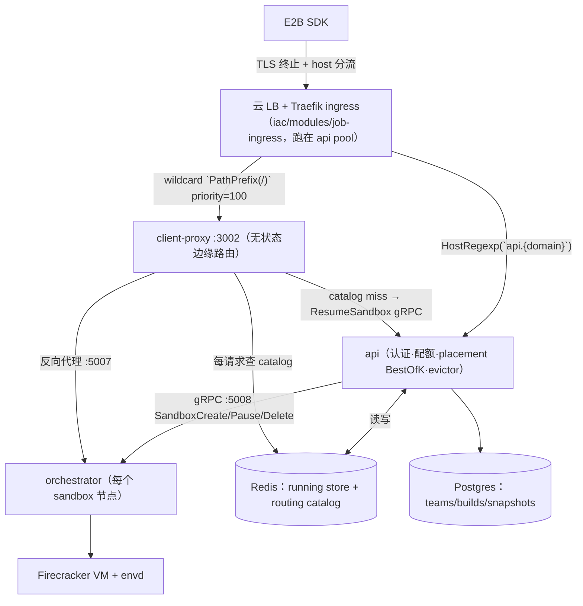
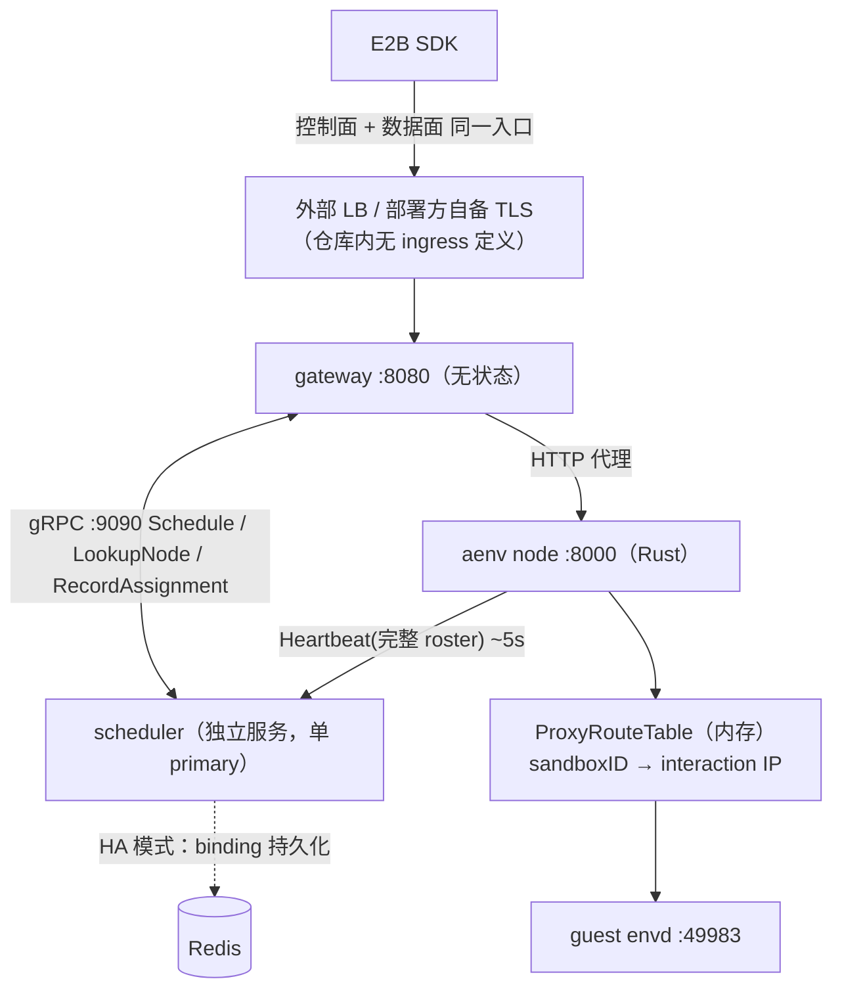
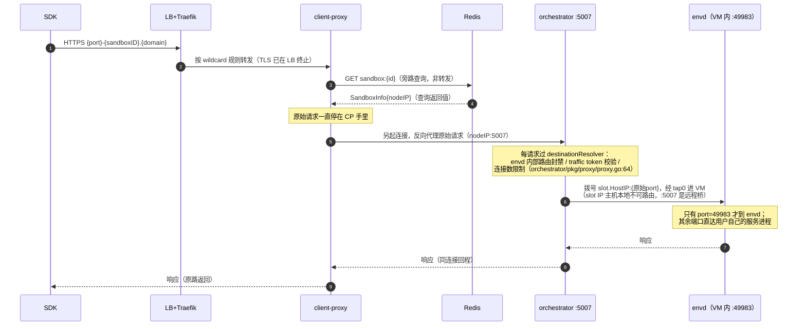
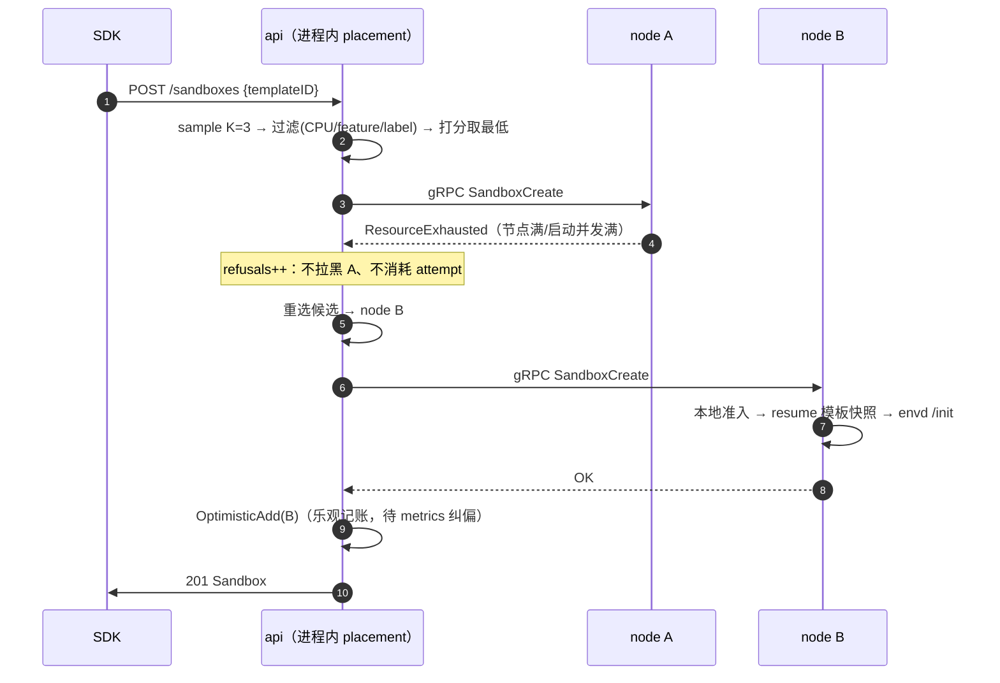
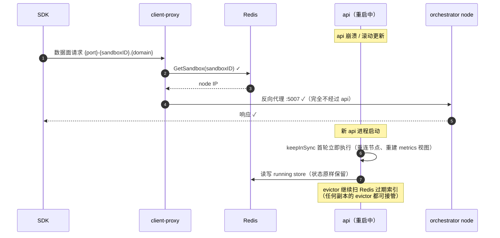
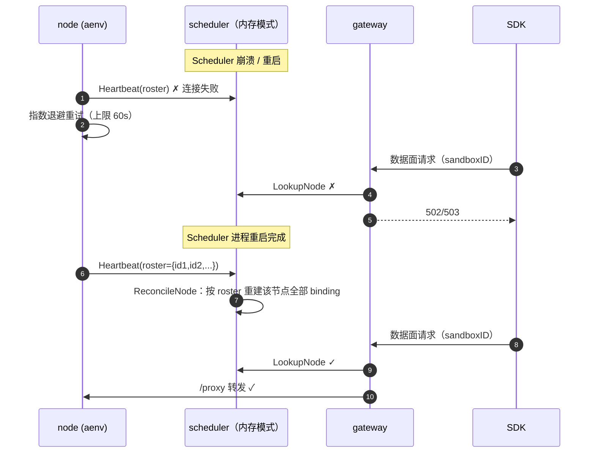

# E2B vs AgentENV：Gateway/Scheduler 架构对比

**状态**：分析报告（v3.1，新增重启恢复对比、调度内嵌形态细节、流程图、边缘入口层）
**日期**：2026-09-10
**分析对象**：
- E2B self-hosted infra：`/home/gateway/infra`（Go）
- AgentENV：`/home/gateway/AgentENV`（Node 为 Rust，Gateway/Scheduler 为 Go）
**参考**：`AgentENV-CONCH-E2B-Cluster-Orchestrator-Envd-MMDS-Design.md`

---

## 0. 总览

| | E2B (`infra/`) | AgentENV (`AgentENV/services/` + `src/`) |
|---|---|---|
| **定位** | 公有云 SaaS 多租户 sandbox 平台 | 自托管大规模 agent 运行环境（Kimi K3 RL 训练） |
| **Gateway** | 职能拆成两个服务：`api`（控制面）+ `client-proxy`（数据面边缘路由） | 单一 `gateway` 服务，控制面+数据面同一入口 `:8080` |
| **Scheduler** | **不是独立服务**——调度逻辑内嵌在 API 进程里（形态见 §2.1） | 独立 gRPC 服务 `scheduler` `:9090` |
| **Node** | Go `orchestrator`（每节点一个，gRPC `:5008`，节点内代理 `:5007`） | Rust `aenv` server（每机器一个，HTTP `:8000`） |
| **CLI** | — | `aenv`（Rust，`crates/aenv/`，start/pause/resume/exec） |

**控制面职责归属对照**（E2B 的 api 是独立服务，同时是“胖”服务——AgentENV 拆成多个服务/位置分担的整个控制面被整体编译进一个进程）：

| 职责 | E2B 归属 | AgentENV 归属 |
|---|---|---|
| 认证 / 配额 | api | gateway |
| 调度（选节点） | api 进程内 | scheduler（独立服务） |
| 超时驱逐 | api 进程内（evictor） | node（Rust 侧后台任务） |
| 数据面路由 | client-proxy | gateway |
| 执行 VM 操作 | orchestrator | aenv node |

注意边界：api 不做数据面路由（client-proxy 的事）、不实际执行沙箱操作（只发 gRPC 下令给 orchestrator）、不存状态（Redis/PG 是真相）。api 是大脑，orchestrator 是手。

**E2B 架构**（注意：数据面流量完全不经过 `api`；且 E2B 没有叫 "gateway" 的组件——网关职能分散在边缘 LB/Traefik 与 client-proxy 两层）：



**AgentENV 架构**（Gateway 是数据面必经之路，路由查询外包给 Scheduler）：



组件与端口对照：

| 组件 | E2B | AgentENV |
|---|---|---|
| 控制面入口 | `packages/api`，HTTP `:80` | `services/gateway`，HTTP `:8080` |
| 数据面入口 | `packages/client-proxy`，`:3002`（health `:3003`） | 同一个 gateway `:8080`（`E2B_API_URL == E2B_SANDBOX_URL`） |
| 调度器 | API 进程内 `internal/orchestrator/placement/` | `services/scheduler`，gRPC `:9090` |
| Node 服务 | `packages/orchestrator`，gRPC `:5008` + sandbox proxy `:5007` | Rust server，HTTP `:8000` |
| 监控端口 | OTel 导出 | Gateway `:9102`、Scheduler `:9101`（Prometheus） |

**关键结论：E2B 的 orchestrator 本身不做调度。** 它只接受"在我这台机器上创建 sandbox"的 gRPC 请求并做本地准入（ResourceExhausted 拒绝）；节点选择（placement）逻辑全部在 `packages/api` 中。

---

## 1. Gateway 层的差异

### 1.0 先厘清：E2B 没有"gateway"这个组件

两边对"网关"这个词的用法不同，对比前先对齐。**AgentENV 有一个具名服务叫 `gateway`**（控制面+数据面唯一入口 `:8080`）；**E2B 仓库里没有任何组件叫 gateway**——网关职能被拆成三层分布式地存在：

| 网关职能 | E2B 中由谁承担 | AgentENV 中由谁承担 |
|---|---|---|
| TLS 终止、外部域名分流 | 云 LB + **Traefik ingress**（`iac/modules/job-ingress/jobs/ingress.hcl`，部署在 api pool） | **仓库内无定义**——`deploy/k8s/base/gateway-service.yaml` 是裸 ClusterIP :8080，无 Ingress/TLS manifest，由部署方自备 |
| 按 sandboxID 路由数据面 | client-proxy（host 解析 + Redis catalog） | gateway `handleProxy`（host/path/header 三来源 + Scheduler `LookupNode`） |
| 认证 / 配额 | api（team key `e2b_`/OIDC/quota 429） | gateway 控制面单一 API key；数据面由 node 校验三类 token |

分流规则写在 Nomad job 的 traefik 标签里：`iac/modules/job-api/jobs/api.hcl:51` 用 `HostRegexp(`api.{domain:.+}`)` 精确捕获控制面域名；`iac/modules/job-client-proxy/jobs/client-proxy.hcl:50-52` 用 `PathPrefix(`/`)` + `priority=100` 接住其余全部 wildcard 流量。E2B 官方架构图（`docs/ARCHITECTURE.md:39`、部署拓扑 `:543`）明确画了这一层，api pool 常驻服务清单（`:549`）也列有 `ingress (Traefik)`。

所以两边的形态是：**AgentENV 网关收敛为一个具名服务**（含路由，不含 TLS）；**E2B 网关职能分布到 LB/Traefik + client-proxy + api 三处，没有任何一个组件叫 gateway**。

### 1.1 E2B：控制面与数据面彻底分离

- **`packages/api`**（`infra/docs/ARCHITECTURE.md:101`）：Gin + OpenAPI 生成的控制面 REST 服务。负责认证（team API key `e2b_` 前缀、OIDC JWT、admin token）、模板解析、配额（team 并发预留 `sandboxStore.Reserve`，超限 429）、**以及调度**。它不是"网关"——它是业务大脑。
- **`packages/client-proxy`**（`ARCHITECTURE.md:243`，`infra/packages/client-proxy/internal/proxy/proxy.go:136`）：无状态边缘路由器 `:3002`。收到 `https://{port}-{sandboxID}.{domain}` 请求后：
  1. 解析 host 得到 sandboxID + port；
  2. 查 **Redis routing catalog**（`infra/packages/shared/pkg/sandbox-catalog/`）拿 node IP；
  3. 反向代理到该 node 的 orchestrator proxy `:5007`；
  4. **catalog miss 时自动唤醒**：调用 API 的 `ResumeSandbox` gRPC（`:5009/:5109`），paused sandbox 被流量透明恢复（`proxy.go:95` `handlePausedSandbox`；API 侧实现 `api/internal/handlers/proxy_grpc.go:127`，走完整 placement）。

#### 数据面一次请求的完整时序（澄清两个常见误读）

Redis 不在转发路径上——client-proxy 对它是**旁路查询**（拿目标节点 IP 的 RPC），用户流量不经过 Redis；orchestrator :5007 也**完全不碰 Redis**（`packages/orchestrator/pkg/proxy/` 零 redis 引用，目的地解析用本机内存 sandbox map，`proxy.go:64`）。响应沿各跳的反向代理连接原路流回：



### 1.2 AgentENV：单入口无状态代理

`services/gateway/internal/server.go:168` `handleProxy` 是核心。每个请求按以下**优先级**确定路由来源（`routeSource`）：

| 优先级 | routeSource | 触发方式 | 动作 |
|---|---|---|---|
| 1 | `host` | `{port}-{sandboxID}.{sandbox_proxy_domains}` | host 路由胜出；与 header 冲突时 host 优先，冲突只记 debug 日志（`server.go:626`） |
| 2 | `path` | `/sandboxes/{id}/pause\|resume\|fork\|connect\|timeout...` 控制面路径 | 从 path 提取 sandboxID |
| 3 | `header` | `x-agentenv-sandbox-id` / `e2b-sandbox-id` + target port header | E2B SDK 兼容 |
| 4 | `schedule` | 无 sandbox ID 的 `POST /sandboxes` | **先 `Schedule()` 再转发** |

关键设计：

- **每请求一次 `LookupNode` gRPC**（`server.go:224`），且走**独立的 query-only scheduler client**（`ServerOptions.QueryOnlySchedulerClient`，未配置时回落主连接）——数据面查询可指向 Redis 只读副本，与写路径隔离；
- 新建成功后 Gateway 异步调 `RecordAssignment` 写 binding（`server.go:469`，超时上限 5s，失败不影响响应）；sandboxID 从上游 201 响应的 header/body 提取（`extractSandboxIDsFromResponse`，`server.go:796`）；**fork 路径逐 child 记录 assignment**；
- `buildScheduleHint`（`schedule_hint.go:15`）从请求 body 提取 cpu/memory/images 作为调度提示（body 读取上限 64KB 并复位，在认证前执行故需限量），但 **body 原样透传给 node，Gateway 不做字段翻译**；
- host/header 来源的数据面请求转发到 node 的 `/proxy` 子树（`upstreamTargetPath` 加前缀），控制面路径原样转发；
- 集群 list（`GET /sandboxes`、`/v2/sandboxes`）扇出到 `ListNodes` 返回的全部 node 并发抓取，**all-or-nothing**：任一 node 失败整体失败；合并按 startedAt 排序 + 去重（keep-first，`cluster_list.go:312` 有 TODO：等 sandbox 迁移支持后改为确定性胜者）；
- 有意绕开 `http.ServeMux`（`server.go:104` 注释）：避免路径规范化（`%2F` 解码、301 重定向）破坏 `/files/%2F` 这类代理转发；
- streaming/WebSocket 识别（gRPC/Connect/SSE/`Te: trailers`），`request_timeout` 不截断长连接；
- 认证模型：控制面单一共享 `X-API-Key`（常量时间比较）；数据面 Gateway 不认证（`server.go:909` 注释），由持有 sandbox policy 的 runtime node 校验三类凭证（API key / `e2b-traffic-access-token` / envd `X-Access-Token`）。

### 1.3 对比要点

| 维度 | E2B | AgentENV |
|---|---|---|
| 入口数量 | 2 个（api `:80` + client-proxy `:3002`） | 1 个（`:8080`） |
| 路由查询 | 查本地 Redis（快，但依赖 Redis） | 每请求 gRPC 到 Scheduler（多一跳，但无本地状态） |
| 暂停唤醒 | client-proxy 内建 auto-resume（→ API `ResumeSandbox`） | Node 侧 auto-resume（见 3.3） |
| 业务逻辑 | api 承载认证/配额/模板解析等全部控制面 | Gateway 几乎纯代理，认证只有单一 API key |
| WebSocket/SSE | client-proxy 支持 | Gateway 显式区分 streaming/WebSocket 请求 |

---

## 2. Scheduler 层的差异（最大差异）

### 2.1 E2B：调度内嵌在 API，best-of-K 打分 + 试错式放置

#### 2.1.1 "内嵌"的具体形态

"不是独立服务"落到实处是这样的（`infra/packages/api/internal/orchestrator/orchestrator.go:44-99`）：

```go
type Orchestrator struct {          // api 进程内的一个聚合结构体
    sandboxStore       *sandbox.Store              // Redis 客户端
    nodes              *smap.Map[*nodemanager.Node] // 节点池（进程内存）
    placementAlgorithm *placement.BestOfK           // ← 调度器就是这里的一个字段
    routingCatalog     e2bcatalog.SandboxesCatalog
    clusters           *clusters.Pool
    // ...
}
```

- placement 代码是 `internal/orchestrator/placement/` **包**，与 handler、evictor 同属 `packages/api` 这一个 Go module，编译进同一个 `api` 二进制——**没有独立进程、没有 RPC/序列化边界**；
- 调度器实例在 API 构造函数里直接 new 出来（`orchestrator.go:145` `placement.NewBestOfK(...)`，`:167` 赋给字段）；
- API 启动时在**同一进程**内拉起四个后台 goroutine（`orchestrator.go:197-221`）：`evictor`（50ms 过期扫描）、`keepInSync`（20s 节点同步）、`startStatusLogging`、`updateBestOfKConfig`（每 30s 从 feature flag 热更新打分参数）；
- 调度所需的节点视图（状态/metrics/**在途创建计数** `PlacementMetrics.InProgress`）全部是本进程内存——这是它能做 optimistic accounting 的前提，也是"内嵌"换来的能力。

**多副本部署下的含义**：api 以 Nomad job 多副本运行（rolling update `max_parallel=1` + canary 健康门，`iac/modules/job-api/jobs/api.hcl:121-135`）。每个副本各自持有 BestOfK 实例 + 私有节点视图 + 私有 in-flight 计数——**两个副本可能同时把 sandbox 放到同一节点**。跨副本的超售窗口不靠调度层协调，而是由 node 端准入控制（§2.1.3）兜底、20s metrics 同步纠偏。这是"调度内嵌"的直接代价：调度视图是每副本私有的，一致性依赖外部状态（Redis）+ 节点仲裁。

AgentENV 相反：scheduler 是独立进程 + 独立 proto（`scheduler.proto`）+ 独立二进制，Gateway 经 gRPC 调用；内存模式下单一 primary，过滤视图天然全局一致。

#### 2.1.2 打分公式

`placement_best_of_K.go:33` `Score`：

```go
score = (cpuRequested + reserved + Alpha*usageAvg) / (R * cpuCount)
// 默认 R=4（集群级超售比）, K=3, Alpha=0.5
// reserved = metrics.CpuAllocated + 在途分配（PlacementMetrics.InProgress）
```

即：**采样 K=3 个候选 node，选"归一化 CPU 承诺+使用率"最低的**。这是 power-of-K-choices 负载均衡的经典做法——不需要全局排序，O(K) 即可获得接近最优的负载均衡。参数通过 LaunchDarkly feature flag 在线调整（`orchestrator.go:320` `updateBestOfKConfig`）。

#### 2.1.3 放置循环（与打分同等重要）

`placement.go:56` `placeSandbox`：

1. `preferredNode`（resume 时的 origin node 亲和）先做 CPU/feature 校验后直接用（`placement.go:77`）——亲和不能越过硬件与版本要求；
2. 循环最多 `maxRetries=3` 次：`chooseNode` 选点 → **直接发 gRPC `SandboxCreate`**（不是"预留"）；
3. Node 回 `ResourceExhausted` → 该 node 不拉黑，换下一个候选继续（`placement.go:198`）；
4. 其他错误 → 拉黑该 node（`nodesExcluded`），`attempt++`；
5. 成功后 **`OptimisticAdd`**（`placement.go:174`）：本地乐观累加资源计数，等下一轮真实 metrics 上报自动纠正——解决"创建成功到 metrics 刷新之间"的窗口超售。



错误分类也很细（`placement.go:103-121`）：只有请求 context 超时/取消才上报 `WarmedNode`（缓存最热的节点），硬失败不绑定节点；纯容量拒绝（`refusals`）到达 deadline 归类为 `NoNodesAvailableError` 而非 `PlacementTimeoutError`。

**过滤维度**（`placement_best_of_K.go:151` `sample`）：

- `CanAcceptNewRequests()`（Draining/Unhealthy 节点排除）；
- **CPU 硬件兼容**（`NodeSatisfiesCPU`：CPU 型号 pin + 单向兼容表，如 Ice Lake→Emerald Rapids，`shared/pkg/machineinfo/machine_info.go:46`）；
- **orchestrator 版本 feature 门控**（`NodeSatisfiesFeatures`：如 filesystem-boot 等新特性要求最低版本，全集群不满足时立即报 `UnsupportedFeatureError` 而不是空转到超时）；
- **label 过滤**（team 级标签约束，节点标签来自 orchestrator 的 `NODE_LABELS` 环境变量；team 无标签时默认 `["default"]`）。

**Node 侧准入控制**（超售的硬底线，`orchestrator/pkg/server/sandboxes.go:212-235`）：

- `MaxSandboxesPerNode`（默认 200）；
- `MaxStartingInstancesPerNode` 并发启动信号量（默认 3）：**快照恢复等待 15s（`waitForAcquire`），冷启动立即拒绝（`TryAcquire`）**——这个不对称是刻意的：恢复值得等，冷启动换节点更便宜。

### 2.2 AgentENV：独立 Scheduler 服务，过滤 + 无状态策略

`services/scheduler/internal/service.go:81` `Schedule` 的流程：

```text
discovered nodes (Snapshot, 不含 lingering)
    → FilterByResourceLimit (filter.go:12)   // 阈值过滤，非打分
    → strategy.Select                        // round_robin 或 random，仅此两种
    → 返回 node，不写任何状态
```

**过滤条件**（`filter.go:19`）——纯阈值判断：

- `MaxSandboxCount` / `MaxSandboxStartingCount`；
- `MaxCPUUsedPercent` / `MaxCPUAllocatedPercent`（allocated 可超 100，允许超售）；
- `MaxMemoryUsedPercent` / `MaxMemoryAllocatedPercent`；
- **including-paused 变体**（`filter.go:73`）：`sandbox_count + paused_sandbox_count` 等组合上限——AgentENV 的 paused sandbox 在 node 上还占持久化状态（`scheduler.proto:119` `NodeSnapshot` 的 paused_* 字段，来自心跳聚合的 `OrchestratorMetrics`，`src/orchestrator/metrics.rs:116`）；
- **无 heartbeat 的节点直接保留**（`filter.go:22`："没有 metrics 就不过滤"）。

**策略**（`strategy.go`）：只有 `RoundRobinStrategy`（原子计数器取模）和 `RandomStrategy`。没有负载打分、没有资源感知放置、没有亲和。hint 传进来但这两个策略都忽略它（`Select(nodes, _)`）。注意这是**设计而非缺陷**：`Strategy` 接口是可插拔的（services README 明言 "pluggable strategy providers"），`RichNode` 携带心跳资源快照、`ScheduleRequestHint` 携带 cpu/memory/images，都是为自定义负载感知策略预留的通道——内置策略刻意保持最简。

### 2.3 关键架构差异：Schedule 语义

| | E2B placement | AgentENV Schedule |
|---|---|---|
| **放置与创建** | 合一：选点后**立即在该 node 上执行 create**，失败换点重试（试错式） | 分离：`Schedule` 只返回候选，Gateway 再转发 create；**Scheduler 不知道 create 是否成功** |
| **状态写入** | API 创建成功后自己写 Redis（强控制） | Gateway 在 node 返回 201 后异步 `RecordAssignment`（最终一致） |
| **超售控制** | 三层：best-of-K 打分（主动避热点）+ node 端准入拒绝（硬底线）+ optimistic accounting（窗口保护） | Scheduler 侧只有静态阈值过滤，兜底靠 node 端 |
| **失败恢复** | 放置循环内自动换点，最多 3 次；容量拒绝不消耗 attempt | 无重试——create 失败直接把错误透传回 SDK |
| **调度器状态** | API 内的 node map + metrics 缓存 | Schedule 完全无状态（设计上可任意扩展 primary） |

### 2.4 状态与一致性模型

**E2B**（`ARCHITECTURE.md:306`）：

- Redis 是 **running sandbox 的 source of truth** + routing catalog，由 API 独占写入；
- node 视图由 API 周期拉取同步（`keepInSync` 每 20s 一轮，`api/internal/orchestrator/cache.go:32`；cluster/instance 发现另有 15s/5s 循环），同步时 `store.Reconcile` 处理孤儿 sandbox（节点上有但 Redis 里没有 → kill，`sandbox/store.go:144`）；
- Postgres 持久实体（templates、builds（含 CPU machine info）、**snapshots 表 = paused sandboxes（含 origin_node_id）**、teams、volumes、clusters）；
- ClickHouse 时序（events、host stats、可选 logs）。

**AgentENV**（`scheduler/internal/store.go`）：

- BindingStore：内存（默认）或 Redis（Lua 脚本原子写，key `agentenv:scheduler:bindings:sandbox:{id}` + 按节点的反向索引 set）；**TTL 过期制**（`binding_ttl` 默认 30s），且**每次心跳 `ReconcileNode` 都会续期**（`redis_store.go:117-155`，Lua 脚本带 TTL 参数重写）——只要 node 活着并心跳，binding 就不会过期；
- **Node heartbeat 携带完整 sandbox roster**（`services/api/proto/scheduler.proto:161` `HeartbeatRequest.sandbox_ids`），Scheduler 收到后 `store.ReconcileNode(node, roster, now)`（`service.go:226`）——**roster 是该节点 binding 的 source of truth**：roster 中消失的 sandbox，其 binding 立即删除。这是自愈机制：Scheduler 重启丢掉内存 binding 后，下一轮 heartbeat 全量补回；
- `report_ttl`（默认 30s）控制 node 健康新鲜度；二者都不等于 sandbox TTL，Node orchestrator 才管理 sandbox 超时；
- 内存模式下明确禁止多 primary 副本（会脑裂）；Redis 模式可加 query-only Scheduler 副本分担 `LookupNode`（`service.go:65` `QueryOnlyService`，Gateway 侧由 `QueryOnlySchedulerClient` 对接）——但明确为**数据面 only**：primary 挂了仍不能新建 sandbox（`services/README.md:293`）。

**Node 状态机分两层**（两系统相同的思想，不同归属）：

- E2B：node 状态由 API 从拉取的 ServiceInfo 推导（Ready/Draining/Unhealthy/ShuttingDown，`nodemanager/status.go`）；
- AgentENV：Scheduler 从 discovery + heartbeat 推导（`READY/CONNECTING/UNHEALTHY/LINGERING`，`node_registry.go:370`），lingering 节点只服务旧 binding、不接新 `Schedule`（K8s 发现时 terminating/no-schedule Pod 标记为 lingering）。

### 2.5 重启与恢复对比

#### 2.5.1 先回答核心问题：AgentENV Gateway 没做恢复逻辑吗？

**对——Gateway 完全没有恢复逻辑，而且这是设计结果而非缺失。** 证据：

- `services/gateway/cmd/main.go` 全文 198 行：加载配置 + API key → 建立 gRPC client（懒连接）→ 起两个 HTTP server → 等 SIGTERM → 优雅停机（HTTP 10s、metrics 5s 超时，`main.go:187-197`）。没有缓存、没有本地状态、没有启动恢复路径；
- `server.go` 中 grep "cache" 零命中——Gateway 对 routing 一无所知，每请求问 Scheduler；
- **无状态 = 无可恢复**。重启后 gRPC client 在下一次 RPC 时懒重连 Scheduler，立即恢复全量服务。重启窗口内丢失的只有未完成的在途请求（由 SDK/客户端重试）；K8s 部署下 readiness probe（`/health`，`deploy/k8s/base/gateway-deployment.yaml:41`）先摘流量再杀进程。

Gateway 可以任意横向扩展、随意滚动重启，不需要任何协调——这是"每请求 gRPC"多一跳换来的东西。

#### 2.5.2 各组件重启行为全景

| 组件重启 | 本地状态 | 恢复机制 | 影响窗口 |
|---|---|---|---|
| **AgentENV Gateway** | 无 | 无需恢复；gRPC 懒重连 | 仅在途请求丢失；readiness 摘流量 |
| **AgentENV Scheduler（内存模式）** | binding + observed 全丢 | **被动自愈**：node 每 ~5s 心跳携带完整 roster，`ReconcileNode` 重建该节点全部 binding（`service.go:226`） | 重启期间数据面 `LookupNode` + 控制面全部失败；恢复后 ≤1 个心跳周期（~5s）补全 |
| **AgentENV Scheduler（Redis + query-only）** | binding 在 Redis（TTL 30s，心跳续期） | query-only 副本继续服务 `LookupNode` | **仅控制面**失败（Schedule/RecordAssignment 需 primary）；数据面不中断。README :293 明确这是 data-plane-only HA |
| **E2B api** | 节点 map/metrics/evictor/BestOfK 配置全在内存 | 启动即执行 `keepInSync` 首轮同步（`cache.go:37` "Run the first sync immediately"）；Redis/PG 状态原样保留 | 控制面短暂不可用（滚动更新 `max_parallel=1` 缓解）；**数据面完全不受影响**（见下）；evictor 重启后继续扫 Redis 过期索引（过期状态本就存 Redis，`storage/redis/items.go:18` EndTime ZSET 索引） |
| **E2B client-proxy** | 无 | 无状态边缘（`ARCHITECTURE.md:245`） | 多副本 + LB，无感 |
| **E2B orchestrator（node）** | sandbox map 全丢 | `startupreclaim` 扫 /proc 杀孤儿 Firecracker 进程组、回收 NBD/网络 slot/cgroup（`pkg/startupreclaim/reclaim.go:33`）；节点以空状态回归 | 该节点上所有 running sandbox 死亡；API 侧 20s 同步发现节点不可达后标记 Unhealthy、按 Reconcile 清理差异 |

#### 2.5.3 E2B 数据面与 API 可用性完全解耦

这是两系统在"重启韧性"上最本质的差异。E2B 的路由查询路径是 **client-proxy → Redis → node :5007**，**不经过 api 进程**（`client-proxy/internal/proxy/proxy.go:143-189`）。api 重启/宕机时：

- ✅ 已运行 sandbox 的全部数据面流量正常（client-proxy 直读 Redis、直连 node proxy）；
- ✅ 超时驱逐不中断——过期判定与 evictor 状态都在 Redis，api 多副本里任何一个 evictor 都能继续扫；
- ❌ 只有两类请求受影响：控制面 REST（create/kill/pause），以及 paused sandbox 的 auto-resume（catalog miss → client-proxy 调 api `ResumeSandbox` gRPC 失败）。



AgentENV 的解耦方式不同：**Gateway 是数据面必经之路**，但它把路由查询外包给 Scheduler，而 Scheduler 的 binding 可由心跳 roster 重建。所以 AgentENV 的数据面可用性 = Gateway 可用性（无状态、可横向扩展）+ Scheduler 可用性（内存模式下重启有窗口；Redis + query-only 模式下数据面不中断）。



#### 2.5.4 AgentENV Scheduler 的一个健康检查盲区（值得注意）

`Schedule` 的候选集来自 discovery `Snapshot(false)`——**只排除 lingering 节点，不检查心跳新鲜度**（`node_registry.go:74-88`）；`FilterByResourceLimit` 对无快照节点直接放行（`filter.go:22`），对有快照节点用**可能已过期的快照**评估。UNHEALTHY 推导只存在于观察 API 的视图里（`deriveObservedNodeViewLocked`，`node_registry.go:370`），不作用于调度路径。

因此：一个已崩溃但仍在 discovery 列表里的节点**仍是 `Schedule` 候选**——选中后失败会在 Gateway→node 的 HTTP 代理步骤才暴露（连接拒绝），且 Gateway 无重试。K8s 模式下 EndpointSlice 摘除 Pod 缓解了此问题；**static discovery 模式则完全暴露**。E2B 对应的防线是 API 侧 `CanAcceptNewRequests()` + 同步失败标记 Unhealthy（4 次重试后，`nodemanager/sync.go:96`）。

#### 2.5.5 恢复哲学总结

| | E2B | AgentENV |
|---|---|---|
| **恢复逻辑的位置** | 集中在"外部状态 + 周期对账"：Redis/PG 是真相，进程是纯函数 | 极化为"心跳即恢复"：一切可重建状态都设计成可从心跳推导 |
| **对账路径** | 三条：`keepInSync`（20s，节点视图+孤儿清理）、evictor（50ms，过期索引）、`startupreclaim`（node 重启后主机资源回收） | 一条：心跳 roster → `ReconcileNode`（binding 全量重建） |
| **数据面韧性** | 与控制面进程完全解耦（client-proxy 直读 Redis） | 与 Scheduler 部分解耦（Gateway 无状态；Scheduler 需 Redis+query-only 才有不中断的数据面） |
| **控制面 HA** | api 多副本 + LB（调度视图每副本私有，节点准入仲裁冲突） | 单 primary（内存模式明确禁止多副本；Redis 模式 query-only 只 HA 数据面） |

---

## 3. Node 层的差异（影响调度设计）

### 3.1 心跳方向相反

- **E2B：API 拉**。API 周期对每个 node 发 `InfoService.ServiceInfo` gRPC（`nodemanager/sync.go:22`），拉回 status + metrics（CPU/mem/hugepages/磁盘明细，`nodemanager/metrics.go:11`）。节点状态由中心视角推导；数据源头是 orchestrator 遍历本地 sandbox map 累加 + gopsutil 主机指标（`orchestrator/pkg/service/service_info.go:37`）。
- **AgentENV：Node 推**。Rust node 发 `Heartbeat`（`src/observability/reporter.rs:253`，间隔默认 5s、指数退避上限 60s），携带 `node_id/cluster_id/service_instance_id`、MachineInfo、NodeSnapshot、**完整 sandbox roster**、P2P endpoint；优雅退出时主动 `UnregisterNode`（`reporter.rs:456`，Scheduler 清除 observed record 与该节点全部 binding），异常退出靠 report TTL 兜底。

### 3.2 各自的独有机制

**E2B：层亲和调度元数据**（`orchestrator/pkg/scheduling/metadata.go:26`）：orchestrator 在 Create/Pause 响应中回传 `SchedulingMetadata`——该 artifact 引用了哪些 build 层（build ID + 字节数，上限 128 层，超限丢最轻的）。这是为"优先选择已缓存这些层的节点"预留的数据通道；**当前 API 尚未消费该字段**。

**E2B：prefetch harvest**（`orchestrator/pkg/server/prefetch_harvest.go:191`）：暂停后起一个**丢弃式热恢复**实例（网络隔离、不进 live 注册表），记录页错误 trace，作为下次 resume 的 prefetch mapping 持久化到快照元数据——用离线成本换在线启动速度。

**E2B：上传窗口期 P2P**：快照异步上传 GCS 期间（单次 20min 超时、总预算 2h），在 Redis 写 `peer:{buildID} → 本节点`，其他节点 resume 优先从 peer 拉 chunk 而非等 GCS（`template/peerclient/registry.go:18`）。

**AgentENV：CPU config 交集**（`scheduler/internal/cpu_template.go:36` `IntersectCpuConfigs`）：`HeartbeatResponse` 返回所有在线节点 Firecracker `cpu_config_json` 的**保守按位 AND 交集**。这是为**跨节点 snapshot 迁移**服务的——只有所有节点都兼容的 CPUID 配置才能保证 snapshot 在任意节点恢复。E2B 没有等价物（它靠 CPU 型号 pin + 单向兼容表过滤，把不兼容节点在放置时排除）。

**AgentENV：warm pool**（`crates/warm-pool/`）：**node 本地**通用预热资源池（非集群预热），水位维护（默认 `low_watermark=2 / high_watermark=64`，`config/default.toml:298`）+ **几何增长的填充目标 ratchet**（`grow_fill_target_after_pressure`，`lib.rs:170`）：取用把池打到低水位以下时，fill target 从 `max(low,1)*2` 逐级向 high 逼近且**进程生命周期内只增不减**——节点观察到突发需求后永久保留额外热容量，不回落到冷启动行为。三个使用方：

1. **网络 slot 池**（`src/sandbox/network/manager.rs:53`）：`AtomicBitSet`（上限 32768 slot）+ `WarmPool<Slot>`，`allocate_any` 先走 `try_acquire` 热路径；
2. **Firecracker 进程池**（`src/sandbox/firecracker/pool.rs:51`）：每个热条目是 `WarmFirecracker { slot, fc_instance, work_dir }` 三位一体——预 spawn 的 FC 进程 + 网络 slot + CWD。**snapshot resume 关键路径消费**（`firecracker/sandbox.rs:1701`）：跳过进程 spawn 和 API socket 轮询；`fill_concurrency=4` 控制单批并发创建，`atexit` 钩子同步清理；
3. **ublk 块设备池**（`src/sandbox/ublk/device.rs:132`）：传给 `uvm-ublk-daemon` 的 OverlayBD 温设备池，因块设备与镜像/尺寸相关走请求路径异步填充。

**冷启动优化对照**：E2B 没有"预启动 VM 池"，它的对应物是 template 本地缓存（TTL 25h）+ UFFD 懒加载内存 + init-trace/last-cycle-diff 预取 + prefetch harvest——同样把冷启动成本压到 node 本地，但路径完全不同（缓存与预取 vs 预留资源池）。

**存储栈对照**：E2B 用 NBD 用户态块服务 + COW rootfs + UFFD 懒加载内存；AgentENV 用 OverlayBD 分层镜像经 ublk 暴露为块设备，且 rootfs 与**内存快照恢复**都走 ublk 设备——同 snapshot 的多个 sandbox 引用计数共享同一只读内存设备，复用 host 页缓存（这是其 9.6x 内存超售的基础之一）。

**P2P 分发通道对照**：AgentENV Scheduler 内建 P2P artifact RPC（`scheduler.proto:15-18`：`ListP2pPeers/RecordP2pArtifact/ForgetP2pArtifact/LookupP2pArtifact`），node 间直接互传镜像/snapshot 数据；E2B 的对应物是 orchestrator 的 `ChunkService`（`orchestrator/pkg/server/chunks.go`）+ Redis peer registry，但走 orchestrator gRPC 而非调度器，且只在快照上传窗口期生效。

### 3.3 暂停/恢复与放置的耦合

- **E2B**：pause = snapshot 异步上传对象存储，sandbox 从 Redis catalog 摘除；resume = 走 create 路径但**优先 origin node**（本地缓存命中则完全不用读对象存储，`ARCHITECTURE.md:430`）；resume 超时会 `maybeRemapResumeOriginNode`（`create_instance.go:540`）把 origin 重定向到实际"焐热"的节点并写回 PG。**没有 VM 级热迁移**——"迁移" = pause + 任意兼容节点 resume。client-proxy 的 catalog miss auto-resume 让 sandbox 表现得像 serverless。超时自动暂停由 API evictor 驱动（50ms tick 扫 Redis 过期索引；auto-pause 被节点拒绝时可降级为 filesystem-only 快照）。
- **AgentENV**：pause 后 binding TTL 内保留路由；node heartbeat roster 维持；resume 由 node 内部状态机管理（`src/orchestrator/service.rs:1509`），配合 warm pool 加速（目标 pause <100ms、resume <50ms，README）。Scheduler 不参与 pause/resume。**数据面 auto-resume 在 Node 侧**：请求到达 node 时若 sandbox 为 Paused 且启用 auto_resume，node 透明恢复后重查 route（`src/api/proxy.rs:785` `try_auto_resume`，60s 超时）——对应 E2B 在 client-proxy 的 catalog-miss resume，但触发位置在 node 而非边缘。
- **两层路由映射严格解耦（AgentENV）**：Scheduler binding（sandboxID → 哪个 node）+ Node 内 `ProxyRouteTable`（sandboxID → 本节点当前 runtime 的 interaction IP，`src/orchestrator/proxy.rs:28`）。route 按 runtime 代际版本化：launch ready 后发布，pause/delete 摘除，pause 失败回滚恢复原 route，resume 成功发布**新** route（resume 可能换 network slot/IP）；HTTP client `pool_max_idle_per_host(0)` 防止跨 runtime 代际复用陈旧 TCP 连接。

### 3.4 生命周期与驱逐的位置差异

| | E2B | AgentENV |
|---|---|---|
| **sandbox 状态机** | API 的 Redis 状态机（running/pausing/killing/snapshotting + AllowedTransitions）；node 维护本地 sandbox map（live/lifecycles/IP 三索引） | Node 内 CAS 状态机（Creating/Running/Pausing/Paused/Resuming/Snapshotting/Forking/Killing，`MetadataStore::update_state_if_state`，`store/mod.rs:66`）；转换冲突时加入并发操作等待（上限 60s） |
| **操作与连接解耦** | gRPC 请求即操作 | `run_cancellation_safe`（`service.rs:260`）：生命周期操作 spawn 到独立 task，**客户端断连不中止服务端操作** |
| **超时驱逐** | **API 侧** evictor（50ms tick 扫 Redis 过期索引；auto-pause 可降级 fs-only） | **Node 侧**后台任务 `evict_expired_sandboxes`（`service.rs:2140`，按 `expires_at` 扫描，`timeout_action` 为 Pause 或 Delete） |
| **优雅停机/重启** | orchestrator 停机走 Draining/ShuttingDown，等待 sandbox 退出（`FORCE_STOP` 跳过等待）；重启后 `startupreclaim` 回收主机资源，空节点回归 | 停机时把 Running sandbox **持久化为 Paused**，重启后 `persister.load_all` + paused reconcile 恢复（`service.rs:2670`、`:191`）——节点重启**不丢 sandbox** |
| **迁移** | 无热迁移：pause（快照到对象存储）+ 任意兼容节点 resume，origin node 亲和 | 无热迁移：snapshot 持久化到 OSS/POSIX 仓库 + 新节点 launch；`cluster_list.go:312` 的去重 TODO 是迁移尚未支持的直接证据，CPU config 交集是为该场景预留 |

注意节点重启语义的深刻差异：E2B 节点重启 = 该节点 sandbox 全灭（恢复靠 client-proxy 触发 resume 或用户重试）；AgentENV 节点重启 = Running 全部转 Paused 持久化，重启后原地恢复。前者把节点重启当作故障，后者把它当作正常操作。

AgentENV 的 Node 持久化只保存 **paused sandbox**（`FileBackedSandboxPersister` → `LocalKvStore` records.db，`src/orchestrator/persistence/file_backed.rs:27`），Running 状态只在内存——重启时靠"停机前转 Paused"的约定保证可恢复。`SandboxBackend` trait（`src/sandbox/backend.rs:185`）把 `PausedSandboxState` 对 Orchestrator 完全不透明化，由具体 backend 自持序列化格式——E2B 没有这层抽象，快照格式（memfile/rootfs/snapfile + header diff 链）是 orchestrator 与对象存储的共享契约。

---

## 4. 差异总结表

| 维度 | E2B | AgentENV |
|---|---|---|
| **调度算法** | best-of-K 打分（CPU 承诺+使用率归一化，K=3/R=4/α=0.5） | 阈值过滤 + round_robin/random（接口可插拔，为负载感知策略预留） |
| **调度位置** | API 进程内（`placement/` 包 + `Orchestrator` 结构体字段，见 §2.1.1） | 独立 gRPC 服务 |
| **选点时机** | 与 create 合一，试错重试 ≤3 次 | 先选点后转发，无重试 |
| **资源记账** | optimistic add + metrics 纠偏 + in-flight 计数（每副本私有） | 静态阈值（含 paused 维度） |
| **node 准入** | 上限 200 sandbox + 并发启动信号量（恢复等 15s / 冷启动即拒） | 无集群级约定，node 自行实现 |
| **亲和性** | resume origin-node 亲和 + 超时 remap（写回 PG） | 无 |
| **硬件/版本约束** | CPU pin + 单向兼容表、orchestrator feature 版本门控、label | CPU config 交集（服务迁移） |
| **路由存储** | Redis catalog（sandboxID→nodeIP），API 独占写 | BindingStore（内存/Redis TTL），Gateway 写 + heartbeat roster 重建 |
| **数据面入口** | client-proxy 独立服务 | Gateway 单入口 |
| **边缘层（TLS/域名分流）** | 云 LB + Traefik ingress（IaC 定义，api pool 常驻） | 仓库无定义，部署方自备（裸 ClusterIP） |
| **gateway 一词所指** | 无此组件——职能分布到 LB/Traefik + client-proxy + api | 具名服务 `services/gateway` |
| **节点发现** | Nomad(服务注册/node pool)/K8s/static/node-plane/cluster-registry，多集群 BYOC | static / K8s EndpointSlice |
| **心跳模型** | API 拉（ServiceInfo + SandboxList，~20s） | Node 推（~5s Heartbeat + roster，退避上限 60s） |
| **暂停唤醒** | client-proxy → API `ResumeSandbox` gRPC | Node 侧 `try_auto_resume`（60s 超时） |
| **超时驱逐** | API evictor（50ms tick） | Node 后台任务（timeout_action Pause/Delete） |
| **优雅停机** | Draining 等待退出 | Running 转持久化 Paused，重启恢复 |
| **多租户** | teams/keys/OIDC/quota/tiers/BYOC 集群 | 单 shared API key + node 级三类 token |
| **状态真相** | Redis（running）+ Postgres（持久） | Node 本地 store + Scheduler binding（派生、可重建） |
| **Guest 存储栈** | NBD + COW rootfs + UFFD 懒加载 | OverlayBD + ublk（内存快照恢复也走块设备，页缓存共享） |
| **集群扩缩容** | Nomad system job + nodepool-autoscaler 插件（`nomad-nodepool-apm`） | K8s DaemonSet / Docker Compose，无 autoscaler |
| **Gateway/入口重启** | api 重启**不影响数据面**（client-proxy 直读 Redis）；client-proxy 无状态多副本 | Gateway 无状态、零恢复逻辑，任意重启/扩副本 |
| **Scheduler/调度层重启** | api 重启后 keepInSync 首轮立即重建节点视图；多副本滚动更新（`max_parallel=1`） | 内存模式：心跳 roster 重建 binding（≤1 心跳周期）；Redis+query-only：数据面不中断，控制面单点 |
| **调度层 HA** | api 多副本（各自 BestOfK，node 准入仲裁跨副本冲突） | 内存模式禁止多 primary；Redis 模式 query-only 只 HA 数据面 |
| **节点重启** | 该节点 sandbox 全灭；startupreclaim 回收资源 | Running 转 Paused 持久化，重启后原地恢复 |

**两层调度解耦（E2B）**：节点数量扩缩容（节点池层面）由 Nomad Autoscaler + `nomad-nodepool-apm` 插件管理；sandbox 放置（哪个节点跑哪个 sandbox）由 API 的 BestOfK 管理。二者完全解耦。AgentENV 没有等价的自动扩缩容层。

**部署形态（AgentENV）**：Docker Compose 四容器（scheduler + gateway + 两个 node）/ K8s（gateway=Deployment+ClusterIP、scheduler=单副本 Deployment、node=privileged DaemonSet 挂 /dev/kvm、headless Service 供 EndpointSlice 发现）；`SANDBOX_PROXY_DOMAINS` 同时注入 gateway 和 node 以维持域名不变量（node 返回的 domain 必须与 gateway 接受的域名一致）。

---

## 5. 设计取舍解读

**E2B 把调度放进 API 是有意的强控制**：多租户 SaaS 需要配额、亲和、版本门控、BYOC 多集群路由，这些都需要业务上下文，拆出去反而要复制状态。代价是 API 是单点胖服务（HA 靠多副本 + Redis 共享视图），placement 与业务深度耦合、无法单独复用。它的可靠性来自**多层防御**：打分避热点 → node 准入兜底 → optimistic accounting 堵窗口 → 试错重试换点；重启韧性来自**外部状态 + 周期对账**——Redis/PG 是真相，进程是纯函数。

**AgentENV 把调度拆成独立服务是极简主义**：单一信任域、自托管，调度只需要"别把请求打到死节点上"。`Schedule` 无状态 + heartbeat roster 重建的设计让整个集群**没有任何强一致组件**——Scheduler 挂了重启，一个心跳周期内 binding 全部自愈；Gateway 干脆没有任何需要恢复的状态。代价是没有精细负载均衡（热点靠 node 端兜底）、调度路径不检查心跳新鲜度（static 发现模式下死节点仍是候选，§2.5.4）、控制面单点。

这也解释了设计文档（`AgentENV-CONCH-E2B-Cluster-Orchestrator-Envd-MMDS-Design.md` §2）中"Gateway/Scheduler 可直接复用给 Conch"的判断：AgentENV 的这两个服务对后端几乎没有业务假设（只要求 node 提供 E2B HTTP API + heartbeat），而 E2B 的 placement 与 API 业务深度耦合，无法剥离复用。

---

## 附：关键代码索引

### E2B（`/home/gateway/infra`）

| 内容 | 位置 |
|---|---|
| 架构文档 | `docs/ARCHITECTURE.md` |
| Orchestrator 聚合结构体（placement 内嵌形态） | `packages/api/internal/orchestrator/orchestrator.go:44`（字段 :49，构造 :145,:167，goroutines :197-221） |
| 放置入口/重试循环 | `packages/api/internal/orchestrator/placement/placement.go:56` |
| best-of-K 打分与采样 | `packages/api/internal/orchestrator/placement/placement_best_of_K.go:33` |
| CPU 兼容（单向兼容表） | `packages/shared/pkg/machineinfo/machine_info.go:46` |
| create 主流程（含放置调用） | `packages/api/internal/orchestrator/create_instance.go:177`（placement 在 :388） |
| node 管理/同步/状态/指标 | `packages/api/internal/orchestrator/nodemanager/{node,sync,status,metrics}.go` |
| API 侧周期同步（首轮立即执行） | `packages/api/internal/orchestrator/cache.go:32`（keepInSync, 20s） |
| 孤儿 sandbox 清理 | `packages/api/internal/sandbox/store.go:144`（Reconcile） |
| Redis 过期索引（evictor 数据源） | `packages/api/internal/sandbox/storage/redis/items.go:18`、`operations.go:30` |
| 集群/实例发现 | `packages/api/internal/clusters/`、`packages/shared/pkg/servicediscovery/`（nomad/kube/static/dns/remote） |
| routing catalog | `packages/shared/pkg/sandbox-catalog/`（Redis 实现 `catalog_redis.go`） |
| client-proxy（数据面不经过 api） | `packages/client-proxy/internal/proxy/proxy.go:136` |
| 自动恢复 gRPC | `packages/api/internal/handlers/proxy_grpc.go:127` |
| evictor/自动暂停 | `packages/api/internal/orchestrator/evictor/evict.go` |
| api 滚动更新（max_parallel=1 canary） | `iac/modules/job-api/jobs/api.hcl:121-135` |
| Traefik ingress job（TLS/边缘层） | `iac/modules/job-ingress/jobs/ingress.hcl` |
| api 的 traefik host 路由标签 | `iac/modules/job-api/jobs/api.hcl:48-52`（HostRegexp api.{domain}） |
| client-proxy 的 wildcard 路由标签 | `iac/modules/job-client-proxy/jobs/client-proxy.hcl:47-54`（PathPrefix(/) priority=100） |
| orchestrator RPC 定义 | `packages/orchestrator/orchestrator.proto`（Create/Update/List/Delete/Pause/Checkpoint） |
| node 侧 Create + 准入 | `packages/orchestrator/pkg/server/sandboxes.go:125`（准入 :212-235） |
| node 侧 Pause/快照 | `packages/orchestrator/pkg/sandbox/sandbox.go:1932` |
| node 重启资源回收 | `packages/orchestrator/pkg/startupreclaim/reclaim.go:33`（FC 进程 :17） |
| prefetch harvest | `packages/orchestrator/pkg/server/prefetch_harvest.go` |
| 层亲和元数据（未消费） | `packages/orchestrator/pkg/scheduling/metadata.go:26` |
| 模板缓存/P2P peer | `packages/orchestrator/pkg/sandbox/template/cache.go`、`template/peerclient/registry.go` |
| 节点内代理 :5007 | `packages/orchestrator/pkg/proxy/proxy.go` |
| Nomad autoscaler 插件 | `packages/nomad-nodepool-apm/`（nodepool APM + deployment-aware target） |

### AgentENV（`/home/gateway/AgentENV`）

| 内容 | 位置 |
|---|---|
| 服务 README（含 HA 模式说明 :293） | `services/README.md` |
| Gateway 主流程 | `services/gateway/internal/server.go:168`（handleProxy） |
| Gateway 入口/优雅停机（无恢复逻辑的证据） | `services/gateway/cmd/main.go:187-197` |
| 路由优先级/host 路由 | `services/gateway/internal/host_route.go:22`、`server.go:626`（冲突日志） |
| 调度提示解析 | `services/gateway/internal/schedule_hint.go:15` |
| 集群 list 聚合 | `services/gateway/internal/cluster_list.go:91`（去重 TODO :312） |
| Gateway K8s readiness | `deploy/k8s/base/gateway-deployment.yaml:41` |
| Scheduler proto | `services/api/proto/scheduler.proto` |
| Schedule 实现 | `services/scheduler/internal/service.go:81` |
| 资源过滤（无快照节点放行 :22） | `services/scheduler/internal/filter.go:12` |
| 策略（round_robin/random） | `services/scheduler/internal/strategy.go` |
| 节点注册表/心跳/状态推导 | `services/scheduler/internal/node_registry.go:140`（Snapshot :74，deriveObservedNodeView :370） |
| BindingStore（roster 重建） | `services/scheduler/internal/store.go:77`（ReconcileNode） |
| Redis binding（心跳续期） | `services/scheduler/internal/redis_store.go:117` |
| 心跳 → binding 重建入口 | `services/scheduler/internal/service.go:226` |
| K8s 发现 | `services/scheduler/internal/kubernetes_discovery.go:72` |
| CPU config 交集 | `services/scheduler/internal/cpu_template.go:36` |
| Node 心跳上报 | `src/observability/reporter.rs:253`（间隔默认 5s，退避上限 60s；UnregisterNode :456） |
| Node orchestrator | `src/orchestrator/service.rs`（create :396 / pause :1282 / resume :1526 / fork :635 / delete :1005） |
| 状态机 CAS | `src/orchestrator/store/mod.rs:66`、`src/orchestrator/types.rs:75` |
| 超时驱逐 | `src/orchestrator/service.rs:2140`（evict_expired_sandboxes） |
| 优雅停机/重启恢复（Running→Paused） | `src/orchestrator/service.rs:2670`（run_shutdown_cleanup）、`:191`（load_all reconcile） |
| Node 持久化（仅 paused） | `src/orchestrator/persistence/file_backed.rs:27` |
| Backend trait（PausedSandboxState 不透明） | `src/sandbox/backend.rs:185` |
| Node 数据面代理/auto-resume | `src/api/proxy.rs`（try_auto_resume :785；header 清洗 :969） |
| ProxyRouteTable | `src/orchestrator/proxy.rs:28` |
| warm pool 通用库 | `crates/warm-pool/src/lib.rs`（水位/ratchet :146,:170） |
| Firecracker 进程池 | `src/sandbox/firecracker/pool.rs:51`（消费点 `firecracker/sandbox.rs:1701`） |
| 网络 slot 池 | `src/sandbox/network/manager.rs:53` |
| ublk 块设备池 | `src/sandbox/ublk/device.rs:132` |
| Node 指标聚合（paused 单列） | `src/orchestrator/metrics.rs:116` |
| 部署编排 | `deploy/docker-compose.yml`、`deploy/k8s/base/` |
